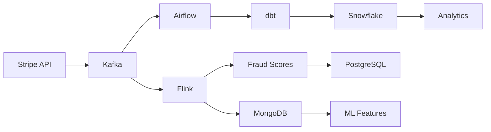

# Stripe Business Case — End-to-End Data Platform Architecture

> AIA Certification Project — Data Engineering & Data Architecture
>
> Design and implementation of a modern data platform supporting transactional processing, analytical workloads, fraud detection, and regulatory compliance.


---

# Executive Summary

Stripe processes millions of payment transactions requiring:

* Strong transactional consistency
* Near real-time fraud detection
* Analytical reporting at scale
* Regulatory compliance (GDPR, PCI-DSS)
* Operational observability

This project proposes and partially implements a modern hybrid architecture combining:

| Layer         | Technology          | Purpose                       |
| ------------- | ------------------- | ----------------------------- |
| OLTP          | PostgreSQL + Citus  | Transaction processing        |
| Streaming     | Kafka + Flink       | Real-time fraud detection     |
| OLAP          | Snowflake + dbt     | Analytics and reporting       |
| NoSQL         | MongoDB             | Event storage and ML features |
| Orchestration | Airflow             | Batch pipelines               |
| ML            | XGBoost + Evidently | Fraud scoring and monitoring  |

---

# Business Requirements

## Functional Requirements

* Process payment transactions
* Support merchant analytics
* Detect fraudulent activity in near real time
* Maintain auditability
* Enable customer segmentation


## Non-Functional Targets

| Requirement               | Target    |
|---------------------------|-----------|
| Availability              | 99.99%    |
| OLTP latency              | < 50 ms   |
| CDC latency               | < 1 s     |
| Fraud scoring latency     | < 100 ms  |
| Analytical query latency  | < 5 s     |
| Recovery Point Objective  | Near-zero |
| Recovery Time Objective   | < 30 min  |


## Validation Status

| Metric                | Status          |
|-----------------------|-----------------|
| OLTP latency          | Not benchmarked |
| CDC latency           | Not benchmarked |
| Fraud scoring latency | Not benchmarked |
| Airflow DAG execution | Demonstrated    |
| MongoDB aggregations  | Demonstrated    |
| dbt transformations   | Demonstrated    |
| SQL analytics         | Demonstrated    |
---

# Scope of Implementation

## Implemented

* PostgreSQL transactional schema
* Airflow ETL DAG
* dbt transformation models
* MongoDB collections and aggregations
* Flink fraud detection job
* Evidently monitoring reports
* Security SQL scripts

## Architecture Design Only

* Snowflake deployment
* Feast infrastructure
* MLflow registry
* Okta integration
* Production Kubernetes deployment

---

# Repository Structure

```text
Stripe-Business-Case/
├── demo/
├── docs/
├── ml/
├── nosql/
├── pipeline/
├── sql/
├── README.md
└── LICENSE
```

| Directory | Purpose                                  |
| --------- | ---------------------------------------- |
| demo      | Screenshots, datasets, local environment |
| docs      | Architecture diagrams                    |
| ml        | Feature engineering and monitoring       |
| nosql     | MongoDB collections and aggregations     |
| pipeline  | Airflow, dbt and Flink pipelines         |
| sql       | OLTP, OLAP and security scripts          |

---

# Architecture Overview

## High-Level Architecture



## Architectural Style

Hybrid Lambda Architecture

### Streaming Layer

* Kafka
* Flink

Purpose:

* Fraud detection
* Event processing
* Real-time enrichment

### Batch Layer

* Airflow
* dbt

Purpose:

* Data quality
* Historical processing
* Analytics

### Serving Layer

* PostgreSQL
* MongoDB
* Snowflake

Purpose:

* Operational workloads
* Analytical workloads
* Machine learning

---

# Architecture Decisions

## Why PostgreSQL?

Selected over CockroachDB because:

* Mature ecosystem
* ACID guarantees
* Native logical replication
* Proven operational reliability

## Why Snowflake?

Selected over Redshift because:

* Compute-storage separation
* Time Travel
* Native dbt integration

## Why MongoDB?

Selected over Cassandra because:

* Flexible schema
* Aggregation framework
* Better support for ML features

## Why Kafka + Flink?

Selected over Kinesis because:

* Open ecosystem
* Stateful processing
* Strong community adoption

---

# OLTP Data Model

Core entities:

* Customers
* Merchants
* Transactions
* Currencies
* Audit Logs

Key design decisions:

* Monthly partitioning
* Partial indexes
* CDC enabled
* Fraud score persistence

See:

```text
sql/oltp/schema.sql
```

---

# OLAP Data Model

Star schema implementation:

Fact:

* fact_transactions

Dimensions:

* dim_customer
* dim_merchant
* dim_date
* dim_currency
* dim_payment_method

Features:

* SCD Type 2
* Historical tracking
* Incremental dbt models

See:

```text
sql/olap/schema.sql
```

---

# MongoDB Data Model

Collections:

## fraud_events

Stores fraud decisions and model outputs.

## user_sessions

Stores clickstream and behavioral events.

## app_logs

Stores operational logs.

Features:

* TTL indexes
* Aggregation pipelines
* Flexible schema evolution

---

# Data Pipeline

## Streaming Flow

```text
PostgreSQL WAL
    ↓
Debezium
    ↓
Kafka
    ↓
Flink
    ↓
Fraud Detection
```

## Batch Flow

```text
PostgreSQL
    ↓
Airflow
    ↓
dbt
    ↓
Snowflake
```

---

# Security & Compliance

## Security Controls

| Area           | Implementation |
| -------------- | -------------- |
| Encryption     | TLS 1.3        |
| Storage        | AES-256        |
| Access         | RBAC           |
| Authentication | MFA            |
| Auditing       | Audit tables   |

## Compliance

Supported requirements:

* GDPR
* PCI-DSS principles
* CCPA

Scripts available:

```text
sql/security/
```

---

# Machine Learning Layer

## Fraud Detection

Model:

* XGBoost

Features:

* Transaction velocity
* Amount anomaly
* Device consistency
* Geographical consistency

## Monitoring

Implemented with Evidently.

Monitored metrics:

* Data drift
* Feature drift
* Model stability

---

# Demonstration

## Airflow DAG


## SQL Query Results


## Evidently Monitoring

Report available:

```text
demo/screenshots/evidently_report.html
```

---

# Local Setup

## Prerequisites

* Docker
* Docker Compose
* Python 3.10+
* Java 17+

## Start Environment

```bash
git clone <repository-url>

cd Stripe-Business-Case/demo/local_setup

docker-compose up -d
```

## Load Sample Data

```bash
psql -h localhost -U postgres -d stripe_db \
-f sample_data/transactions.sql
```

## Launch Airflow

```bash
airflow standalone
```

## Run dbt

```bash
dbt run
dbt test
```

---

# Future Improvements

* Kubernetes deployment
* Data contracts
* Great Expectations integration
* Real-time feature store
* Multi-region disaster recovery

---

# Key Takeaways

This project demonstrates:

* Data platform architecture
* Data modeling
* Batch and streaming pipelines
* Fraud detection concepts
* Data governance
* Regulatory compliance design
* MLOps monitoring practices

The objective is not to reproduce Stripe's production platform but to demonstrate architectural decisions, implementation capabilities, and trade-off analysis expected from a senior Data Engineer / Data Architect.
