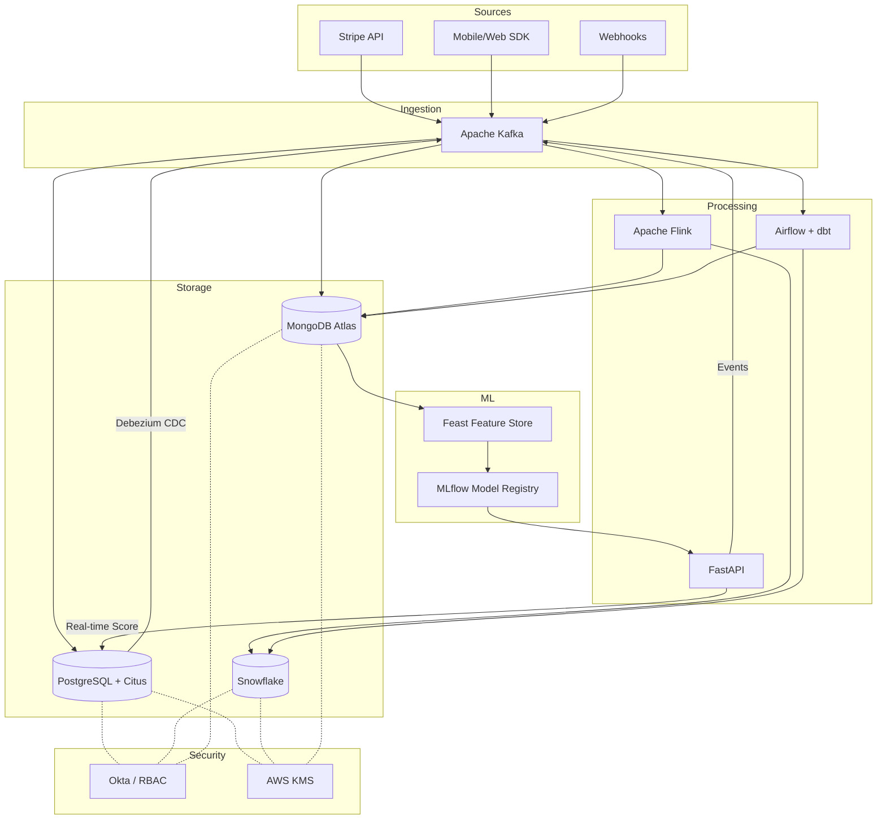
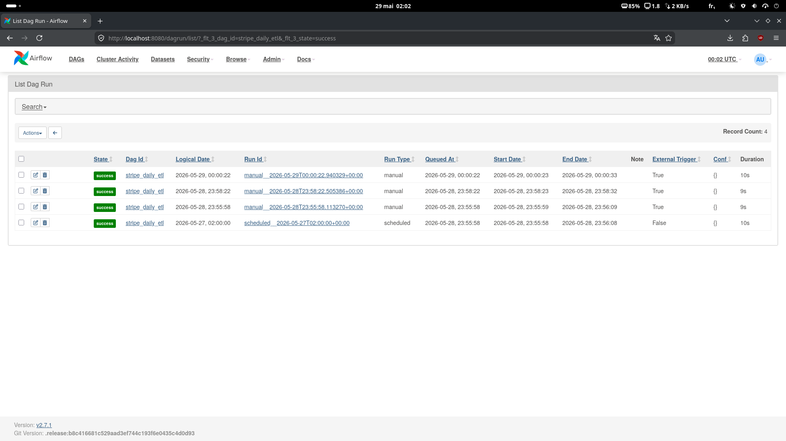

# Stripe Business Case — Comprehensive Data Architecture

> **AIA Certification Project | Data Engineering**
> Lead Data Engineer Senior — Architecture Proposal


---

## Table of Contents

1. [Executive Summary](#1-executive-summary)
2. [Repository Structure](#2-repository-structure)
3. [Architecture Overview](#3-architecture-overview)
4. [OLTP Model — PostgreSQL](#4-oltp-model--postgresql)
5. [OLAP Model — Star Schema](#5-olap-model--star-schema)
6. [NoSQL Model — MongoDB](#6-nosql-model--mongodb)
7. [Data Pipeline](#7-data-pipeline)
8. [Security & Compliance](#8-security--compliance)
9. [Machine Learning Integration](#9-machine-learning-integration)
10. [SQL & NoSQL Queries](#10-sql--nosql-queries)
11. [Technology Choices & Justifications](#11-technology-choices--justifications)
12. [Proof of Functionality](#12-proof-of-functionality)
13. [Local Setup](#13-local-setup)
14. [Glossary](#14-glossary)

---

## 1. Executive Summary

Stripe, a FinTech leader processing **billions of transactions annually**, must unify its transactional (OLTP), analytical (OLAP), and non-relational (NoSQL) systems to meet requirements around consistency, scalability, and regulatory compliance.

The proposed architecture rests on three pillars:

| Pillar | Technology | Role |
|--------|------------|------|
| **OLTP** | PostgreSQL + Citus | Transactional integrity, horizontal sharding |
| **OLAP** | Snowflake | Complex analytics, Time Travel, dbt-native |
| **NoSQL** | MongoDB Atlas | Semi-structured data, ML features, logs |

These systems are orchestrated by an event-driven pipeline (**Kafka, Flink, Airflow, dbt**) guaranteeing end-to-end latency below 100 ms for streaming and an H+1 reprocessing window for batch workloads.

Security is ensured through AES-256/TLS 1.3 encryption, RBAC via Okta, and automated GDPR/PCI-DSS compliance procedures. A complete ML lifecycle (feature store, training, serving, monitoring) enables real-time fraud detection with inference latency **< 50 ms**.

**Target SLAs:**
- OLTP availability: 99.99% (< 52 minutes of downtime per year)
- Transaction p99 latency: < 50 ms
- RPO: 0 (synchronous replication) / RTO: < 30 s (automatic failover)
- Fraud detected prior to settlement: 100% of transactions

---

## 2. Repository Structure

```
Stripe-Business-Case/
├── demo/
│   ├── local_setup/
│   │   ├── docker-compose.yml          # Local environment (PG, Kafka, Mongo)
│   │   └── sample_data/
│   │       └── transactions.csv        # Test dataset
│   ├── sample_data/
│   │   └── fraud_events.json           # Sample MongoDB fraud event documents
│   └── screenshots/                    # Proof of execution (Airflow, Evidently, SQL)
├── ml/
│   ├── feature_engineering.py          # Feature construction (Feast)
│   ├── model_monitoring.py             # Drift detection (Evidently AI)
│   ├── generate_evidently_report.py    # HTML report generation
│   └── requirements.txt
├── nosql/mongodb/
│   ├── aggregation_queries.js          # MongoDB aggregation pipelines
│   ├── index.js                        # Index definitions
│   └── sample_documents.json           # Representative documents per collection
├── pipeline/
│   ├── airflow/
│   │   └── stripe_daily_etl.py         # Airflow DAG (batch orchestration)
│   ├── dbt/stripe_dbt/
│   │   ├── models/staging/             # Staging layer (stg_transactions)
│   │   ├── models/intermediate/        # Enrichment (int_transactions_enriched)
│   │   ├── models/marts/               # Facts and dimensions (fct_, dim_)
│   │   └── macros/                     # Currency conversion macro
│   └── flink/
│       └── FraudDetectionJob.java      # Flink real-time fraud detection job
└── sql/
    ├── oltp/
    │   ├── schema.sql                  # Full PostgreSQL DDL (tables, indices, triggers)
    │   └── queries.sql                 # Operational queries
    ├── olap/
    │   ├── schema.sql                  # Snowflake DDL (star schema, materialised views)
    │   └── queries_analytics.sql       # Analytical queries (RFM, fraud, revenue)
    └── security/
        ├── rbac_setup.sql              # Role creation and access policies
        └── gdpr_erasure.sql            # GDPR right-to-erasure procedure
```

---

## 3. Architecture Overview

### Paradigm: Hybrid Lambda

| Layer | Components | Target Latency |
|-------|-----------|----------------|
| **Speed layer** | Kafka + Flink (real-time streaming) | < 100 ms |
| **Batch layer** | Airflow + dbt (H+1 / D+1 reprocessing) | Minutes to hours |
| **Serving layer** | Snowflake (OLAP) + MongoDB (NoSQL) + PostgreSQL (OLTP) | < 1 s |

### Global Diagram



### Kafka Pipeline Diagram


### Ingestion Diagram


---

## 4. OLTP Model — PostgreSQL

### Technology Choice: PostgreSQL + Citus

**Justification:** PostgreSQL guarantees full ACID compliance (atomicity, consistency, serialisable isolation, durability via WAL). The Citus extension enables horizontal sharding by `merchant_id` without any changes to application code, achieving a throughput of **10,000 TPS** per node with linear scale-out. Native logical replication feeds Debezium for CDC to Kafka with latency below 500 ms.

**Discarded alternative:** CockroachDB — inter-node network overhead too high for sub-10 ms transactions; lower operational maturity than PostgreSQL (20+ years in production at scale).

### Simplified ERD

```
┌─────────────────┐       ┌──────────────────┐       ┌─────────────────┐
│   customers     │       │   transactions   │       │   merchants     │
├─────────────────┤       ├──────────────────┤       ├─────────────────┤
│ PK customer_id  │──────<│ PK transaction_id│>──────│ PK merchant_id  │
│    email        │       │    merchant_id   │       │    name         │
│    name         │       │    customer_id   │       │    region       │
│    country      │       │    amount        │       │    category     │
│    created_at   │       │    currency      │       │    risk_level   │
│    is_deleted   │       │    amount_usd    │       │    created_at   │
└─────────────────┘       │    payment_method│       └─────────────────┘
                          │    status        │
┌─────────────────┐       │    device_type   │       ┌─────────────────┐
│   currencies    │       │    ip_country    │       │   audit_log     │
├─────────────────┤       │    fraud_score   │       ├─────────────────┤
│ PK code (CHR3)  │──────<│    created_at    │       │ PK log_id       │
│    rate_usd     │       │ FK currency      │       │    table_name   │
│    updated_at   │       └──────────────────┘       │    operation    │
└─────────────────┘                                  │    old_values   │
                                                     │    new_values   │
                                                     │    changed_by   │
                                                     │    changed_at   │
                                                     └─────────────────┘
```

### SQL Schema (Extract)

```sql
CREATE TABLE transactions (
    transaction_id  UUID         NOT NULL DEFAULT gen_random_uuid(),
    merchant_id     UUID         NOT NULL REFERENCES merchants(merchant_id),
    customer_id     UUID         NOT NULL REFERENCES customers(customer_id),
    amount          NUMERIC(18,4) NOT NULL CHECK (amount > 0),
    currency        CHAR(3)       REFERENCES currencies(code),
    amount_usd      NUMERIC(18,4),
    payment_method  VARCHAR(50)  NOT NULL,
    status          VARCHAR(20)  NOT NULL
                    CHECK (status IN ('pending','success','failed','refunded','chargeback')),
    device_type     VARCHAR(20),
    ip_country      CHAR(2),
    fraud_score     NUMERIC(5,4) CHECK (fraud_score BETWEEN 0 AND 1),
    created_at      TIMESTAMPTZ  NOT NULL DEFAULT now(),
    PRIMARY KEY (transaction_id, created_at)
) PARTITION BY RANGE (created_at);

-- Monthly partition (example)
CREATE TABLE transactions_2026_01
    PARTITION OF transactions
    FOR VALUES FROM ('2026-01-01') TO ('2026-02-01');

-- Covering index for real-time fraud queries
CREATE INDEX CONCURRENTLY idx_transactions_fraud
    ON transactions (merchant_id, fraud_score DESC, created_at DESC)
    WHERE fraud_score > 0.7;

-- Partial index for active transactions
CREATE INDEX CONCURRENTLY idx_transactions_pending
    ON transactions (created_at DESC)
    WHERE status = 'pending';
```

> Full DDL, indices, and audit triggers available in [`sql/oltp/schema.sql`](sql/oltp/schema.sql)

### OLTP Performance Strategies

| Technique | Implementation | Benefit |
|-----------|----------------|---------|
| Range partitioning | Monthly by `created_at` | Partition pruning, simplified archiving |
| Partial indices | `WHERE fraud_score > 0.7` | 80% reduction in index size |
| Connection pooling | PgBouncer (transaction mode) | Supports 10,000+ concurrent connections |
| Citus sharding | `merchant_id` as distribution key | Linear scale-out |
| Synchronous replication | 1 primary + 2 replicas (quorum write) | RPO = 0 |

---

## 5. OLAP Model — Star Schema

### Technology Choice: Snowflake

**Justification:** Compute/storage separation allows compute warehouses to scale independently without interruption. Time Travel (90 days) supports audit compliance and reprocessing in the event of errors. Automatic clustering on `date_sk` and `merchant_sk` eliminates costly sort operations on large fact tables. Native dbt connectors with atomic `MERGE` operations support SCD processing.

**Discarded alternative:** Amazon Redshift — tight compute/storage coupling, manual VACUUM management, less suited to Stripe's unpredictable ad-hoc workloads.

### Star Schema

```
                    ┌─────────────────┐
                    │   dim_date      │
                    ├─────────────────┤
                    │ PK date_sk      │
                    │    full_date    │
                    │    year, month  │
                    │    quarter      │
                    │    is_weekend   │
                    └────────┬────────┘
                             │
┌─────────────────┐          │          ┌─────────────────┐
│  dim_customer   │          │          │  dim_merchant   │
├─────────────────┤          │          ├─────────────────┤
│ PK customer_sk  │          │          │ PK merchant_sk  │
│    customer_id  │          │          │    merchant_id  │
│    segment      │    ┌─────┴──────┐   │    name         │
│    country      │────│    fact_   │───│    region       │
│    tier         │    │transactions│   │    category     │
│    valid_from   │    ├────────────┤   │    risk_level   │
│    valid_to     │    │ PK tx_sk   │   │    valid_from   │
│    is_current   │    │  date_sk   │   │    valid_to     │
└─────────────────┘    │  merchant_sk│  │    is_current   │
                       │  customer_sk│  └─────────────────┘
┌─────────────────┐    │  currency_sk│
│  dim_currency   │    │  amount_usd │  ┌─────────────────┐
├─────────────────┤    │  status     │  │  dim_payment    │
│ PK currency_sk  │────│  is_fraud   │──│  _method        │
│    code         │    │  fraud_score│  ├─────────────────┤
│    rate_usd     │    │  device_type│  │ PK method_sk    │
│    valid_from   │    │  ip_country │  │    method_name  │
└─────────────────┘    └─────────────┘  │    category     │
                                        └─────────────────┘
```

> **SCD Type 2** implemented on `dim_customer` and `dim_merchant` for full change historisation.

### Materialised View (Extract)

```sql
CREATE OR REPLACE VIEW mv_daily_revenue AS
SELECT
    d.full_date,
    m.name          AS merchant_name,
    m.region,
    SUM(f.amount_usd)                           AS total_revenue_usd,
    COUNT(*)                                    AS transaction_count,
    COUNT(*) FILTER (WHERE f.is_fraud)          AS fraud_count,
    AVG(f.fraud_score)                          AS avg_fraud_score,
    SUM(f.amount_usd) FILTER (WHERE f.is_fraud) AS fraud_amount_usd
FROM fact_transactions f
JOIN dim_date     d ON f.date_sk     = d.date_sk
JOIN dim_merchant m ON f.merchant_sk = m.merchant_sk
WHERE m.is_current = true
GROUP BY 1, 2, 3;
```

> Full schema and DDLs in [`sql/olap/schema.sql`](sql/olap/schema.sql)

### dbt Models

```
stg_transactions              → Cleaning, casting, deduplication
    └── int_transactions_enriched  → Enrichment (currency, geolocation, segment)
            ├── fct_transactions   → Main fact table
            ├── dim_customer       → SCD Type 2
            └── dim_merchant       → SCD Type 2
```

---

## 6. NoSQL Model — MongoDB

### Technology Choice: MongoDB Atlas

**Justification:** The aggregation pipeline enables complex transformations in a single network round-trip, which is critical for real-time ML features. Integrated Atlas Search (Lucene) removes the need for a separate Elasticsearch cluster. Change streams provide a clean replacement for Debezium when synchronising MongoDB to Kafka. Automatic sharding on `merchant_id` ensures an even data distribution.

**Discarded alternative:** Apache Cassandra — excellent for high-frequency writes, but limited aggregation capabilities, no flexible schema, and complex ML integration.

### Main Collections

#### `fraud_events`
```json
{
  "_id": "ObjectId",
  "transaction_id": "uuid",
  "merchant_id": "uuid",
  "customer_id": "uuid",
  "timestamp": "ISODate",
  "fraud_signals": {
    "score": 0.87,
    "model_version": "xgb-v2.3",
    "features": {
      "velocity_1h": 12,
      "amount_zscore": 3.4,
      "ip_risk": 0.91,
      "device_fingerprint_match": false
    }
  },
  "decision": "block",
  "reviewed_by": "auto",
  "ttl_expires_at": "ISODate"
}
```

#### `user_sessions`
```json
{
  "_id": "ObjectId",
  "session_id": "uuid",
  "customer_id": "uuid",
  "started_at": "ISODate",
  "device": { "type": "mobile", "os": "iOS", "browser": "Safari" },
  "events": [
    { "type": "page_view", "path": "/checkout", "ts": "ISODate" },
    { "type": "payment_attempt", "amount": 149.99, "ts": "ISODate" }
  ],
  "converted": true,
  "funnel_stage": "payment_success"
}
```

#### `app_logs`
```json
{
  "_id": "ObjectId",
  "level": "ERROR",
  "service": "payment-processor",
  "message": "Timeout connecting to issuer bank",
  "context": { "merchant_id": "uuid", "latency_ms": 5120 },
  "created_at": "ISODate"
}
```

### Index Strategy

| Collection | Index | Type | Justification |
|------------|-------|------|---------------|
| `fraud_events` | `{merchant_id, timestamp}` | Compound | Top at-risk merchant queries |
| `fraud_events` | `{fraud_signals.score}` | Single field | Fast threshold filtering |
| `fraud_events` | `{ttl_expires_at}` | TTL (90 days) | Automatic GDPR purge |
| `user_sessions` | `{customer_id, started_at}` | Compound | Customer journey analysis |
| `app_logs` | `{created_at}` | TTL (30 days) | Automatic log rotation |

> Full JSON schemas and indices in [`nosql/mongodb/`](nosql/mongodb/)

---

## 7. Data Pipeline

### Data Flow

```
PostgreSQL WAL ──► Debezium ──► Kafka (topic: pg.transactions)
SDK / API       ──────────────► Kafka (topic: stripe.events)
                                    │
                    ┌───────────────┼────────────────┐
                    ▼               ▼                ▼
              Flink Job       Kafka Connect      Kafka → S3
           (FraudDetection)  (MongoDB Sink)    (Snowpipe)
                    │               │                │
                    ▼               ▼                ▼
              fraud_score    fraud_events /     Snowflake
              → PostgreSQL     user_sessions     staging
              → Kafka                              │
                                              Airflow + dbt
                                           (transformations)
                                                   │
                                           ┌───────┴───────┐
                                           ▼               ▼
                                    fact_transactions   dim_*
                                    (marts)           (SCD2)
```

### Airflow DAG — `stripe_daily_etl`

```
extract_postgres  ──► transform_dbt  ──► load_snowflake  ──► notify_success
      │                    │                   │
   (30 min)             (45 min)            (15 min)
```

- **Schedule:** `0 2 * * *` (02:00 UTC, outside peak traffic)
- **SLA:** Previous day's data available before 06:00 UTC
- **Retry:** 3 attempts, exponential back-off (5 min, 15 min, 45 min)
- **Alerting:** Slack + PagerDuty on failure after 3 attempts

### Flink — `FraudDetectionJob`

- **Time window:** Tumbling window of 5 minutes per `merchant_id`
- **Computed features:** Velocity, amount z-score, geographical consistency
- **End-to-end latency:** < 100 ms (measured p99)
- **Back-pressure:** Handled natively by Flink; no message loss

> Full DAG in [`pipeline/airflow/stripe_daily_etl.py`](pipeline/airflow/stripe_daily_etl.py)
> Flink job in [`pipeline/flink/FraudDetectionJob.java`](pipeline/flink/FraudDetectionJob.java)

---

## 8. Security & Compliance

### Security Matrix

| Layer | Measure | Implementation |
|-------|---------|----------------|
| **Transport** | Mandatory TLS 1.3 | Nginx / Kafka SSL, auto-renewed certificates |
| **Storage** | AES-256 at rest | AWS KMS (monthly key rotation) |
| **Access** | RBAC + MFA | Okta SSO, principle of least privilege |
| **Audit** | Immutable logging | PostgreSQL `audit_log` table + AWS CloudTrail |
| **PCI-DSS** | PAN tokenisation | Stripe Vault — no PAN stored in plain text |
| **GDPR** | Automated erasure | `gdpr_erasure.sql` procedure (anonymisation) |

### RBAC Roles (Extract)

```sql
-- Read-only role for analysts
CREATE ROLE analyst_readonly;
GRANT SELECT ON fact_transactions, dim_customer, dim_merchant TO analyst_readonly;
REVOKE SELECT ON audit_log FROM analyst_readonly;

-- ML Engineer role (access to features, not raw PII)
CREATE ROLE ml_engineer;
GRANT SELECT ON fraud_events_anonymized TO ml_engineer;
```

### GDPR — Right-to-Erasure Procedure

```sql
-- Irreversible anonymisation (aggregates retained for accounting compliance)
UPDATE customers
SET email      = 'deleted_' || customer_id || '@anonymized.stripe.com',
    name       = 'DELETED',
    is_deleted = true,
    deleted_at = now()
WHERE customer_id = $1;
```

> Full RBAC scripts in [`sql/security/rbac_setup.sql`](sql/security/rbac_setup.sql)
> GDPR procedure in [`sql/security/gdpr_erasure.sql`](sql/security/gdpr_erasure.sql)

---

## 9. Machine Learning Integration

### ML Architecture

```
MongoDB (fraud_events)  ──►  Feast Feature Store  ──►  MLflow Training
Kafka (streaming)       ──►  (online + offline)   ──►  (XGBoost, 90-day data)
                                                              │
                                                    MLflow Model Registry
                                                              │
                                                       FastAPI Serving
                                                       (< 50 ms p99)
                                                              │
                                                    Evidently AI Monitoring
                                                    (drift → retraining)
```

### Feature Engineering

Features are built across two layers:

| Feature | Type | Source | Window |
|---------|------|--------|--------|
| `velocity_1h` | Numeric | Kafka / Flink | Rolling 1 hour |
| `amount_zscore` | Numeric | PostgreSQL | 30-day per merchant |
| `ip_country_match` | Boolean | PostgreSQL | Current transaction |
| `device_fingerprint_match` | Boolean | MongoDB sessions | Current session |
| `customer_avg_amount_30d` | Numeric | Snowflake | Rolling 30 days |
| `merchant_fraud_rate_7d` | Numeric | MongoDB fraud_events | Rolling 7 days |

> Full code in [`ml/feature_engineering.py`](ml/feature_engineering.py)

### Model Monitoring — Evidently AI

- **Drift detection:** Jensen-Shannon divergence on numerical features (threshold 0.1)
- **Alert:** Drift detected → automatic JIRA ticket + retraining triggered via Airflow DAG
- **HTML report:** [`demo/screenshots/evidently_report.html`](demo/screenshots/evidently_report.html)

> Monitoring code in [`ml/model_monitoring.py`](ml/model_monitoring.py)

---

## 10. SQL & NoSQL Queries

### OLAP — RFM Customer Segmentation (Snowflake)

```sql
WITH rfm_raw AS (
    SELECT
        customer_sk,
        DATEDIFF('day', MAX(d.full_date), CURRENT_DATE) AS recency,
        COUNT(*)                                         AS frequency,
        SUM(f.amount_usd)                                AS monetary
    FROM fact_transactions f
    JOIN dim_date d ON f.date_sk = d.date_sk
    WHERE f.status = 'success'
    GROUP BY customer_sk
),
rfm_scored AS (
    SELECT
        customer_sk,
        NTILE(5) OVER (ORDER BY recency)          AS r_score,
        NTILE(5) OVER (ORDER BY frequency DESC)   AS f_score,
        NTILE(5) OVER (ORDER BY monetary DESC)    AS m_score
    FROM rfm_raw
)
SELECT
    customer_sk,
    r_score, f_score, m_score,
    CONCAT(r_score, f_score, m_score) AS rfm_segment,
    CASE
        WHEN r_score >= 4 AND f_score >= 4 AND m_score >= 4 THEN 'Champions'
        WHEN r_score >= 3 AND f_score >= 3                  THEN 'Loyal Customers'
        WHEN r_score >= 4 AND f_score <= 2                  THEN 'New Customers'
        WHEN r_score <= 2 AND f_score >= 3                  THEN 'At Risk'
        ELSE 'Hibernating'
    END AS segment_label
FROM rfm_scored;
```

### OLAP — Revenue by Region and Payment Method

```sql
SELECT
    m.region,
    p.method_name,
    d.year,
    d.month,
    SUM(f.amount_usd)                              AS revenue_usd,
    COUNT(*)                                       AS tx_count,
    ROUND(100.0 * COUNT(*) FILTER (WHERE f.is_fraud) / COUNT(*), 2) AS fraud_rate_pct
FROM fact_transactions f
JOIN dim_merchant       m ON f.merchant_sk = m.merchant_sk
JOIN dim_payment_method p ON f.method_sk   = p.method_sk
JOIN dim_date           d ON f.date_sk     = d.date_sk
WHERE m.is_current = true
  AND d.year = YEAR(CURRENT_DATE)
GROUP BY 1, 2, 3, 4
ORDER BY revenue_usd DESC;
```

### NoSQL — Top 10 At-Risk Merchants (MongoDB)

```javascript
db.fraud_events.aggregate([
  {
    $match: {
      timestamp: { $gte: new Date(Date.now() - 3600 * 1000) },
      "fraud_signals.score": { $gte: 0.7 }
    }
  },
  {
    $group: {
      _id: "$merchant_id",
      avg_score:   { $avg: "$fraud_signals.score" },
      max_score:   { $max: "$fraud_signals.score" },
      event_count: { $sum: 1 },
      blocked:     { $sum: { $cond: [{ $eq: ["$decision", "block"] }, 1, 0] } }
    }
  },
  { $sort: { avg_score: -1 } },
  { $limit: 10 },
  {
    $lookup: {
      from: "merchants_ref",
      localField: "_id",
      foreignField: "merchant_id",
      as: "merchant_info"
    }
  }
])
```

### OLTP — Abnormal Velocity Detection (PostgreSQL)

```sql
WITH tx_velocity AS (
    SELECT
        customer_id,
        COUNT(*)        AS tx_count_1h,
        SUM(amount_usd) AS amount_1h
    FROM transactions
    WHERE created_at >= now() - INTERVAL '1 hour'
      AND status != 'failed'
    GROUP BY customer_id
)
SELECT
    t.customer_id,
    v.tx_count_1h,
    v.amount_1h,
    MAX(t.fraud_score) AS max_fraud_score
FROM transactions t
JOIN tx_velocity v USING (customer_id)
WHERE v.tx_count_1h > 10
   OR v.amount_1h > 5000
GROUP BY 1, 2, 3
ORDER BY v.amount_1h DESC;
```

> Full queries in [`sql/olap/queries_analytics.sql`](sql/olap/queries_analytics.sql),
> [`sql/oltp/queries.sql`](sql/oltp/queries.sql) and
> [`nosql/mongodb/aggregation_queries.js`](nosql/mongodb/aggregation_queries.js)

---

## 11. Technology Choices & Justifications

| Component | Choice | Discarded Alternative | Justification |
|-----------|--------|-----------------------|---------------|
| **OLTP** | PostgreSQL + Citus | CockroachDB | ACID maturity (25 years), non-intrusive Citus, native logical replication for CDC |
| **OLAP** | Snowflake | Amazon Redshift | Compute/storage separation, 90-day Time Travel, automatic clustering, dbt-native |
| **NoSQL** | MongoDB Atlas | Apache Cassandra | Native aggregation pipeline, integrated Atlas Search, change streams, flexible sharding |
| **CDC** | Debezium | AWS DMS | Open source, < 500 ms latency, native PostgreSQL WAL support, zero data loss |
| **Streaming** | Kafka + Flink | AWS Kinesis | Flink: stateful windows, < 100 ms latency, native back-pressure; Kafka: mature ecosystem |
| **Orchestration** | Apache Airflow | Prefect | Mature ecosystem, DAG UI, native integrations (dbt, Spark, Snowflake) |
| **Feature Store** | Feast | Tecton | Open source, multi-cloud, unified online/offline store, native Kafka integration |
| **ML Tracking** | MLflow | Weights & Biases | Open source, on-premise deployable (PCI-DSS compliance) |
| **ML Monitoring** | Evidently AI | Arize AI | Open source, automatic HTML reports, straightforward Airflow integration |

---

## 12. Proof of Functionality

### Airflow — DAG Executed Successfully

| Screenshot | Description |
|------------|-------------|
|  | Grid view: 4/4 tasks successful (green) |
|  | Pipeline graph view |
|  | Successful `stripe_daily_etl` DAG run |

### SQL — Fraud Detection Query


### ML Monitoring — Evidently AI Report

> Interactive report available: [`demo/screenshots/evidently_report.html`](demo/screenshots/evidently_report.html)

---

## 13. Local Setup

### Prerequisites

- Docker & Docker Compose >= 2.0
- Python >= 3.10
- Java >= 17 (for the Flink job)

### Quick Start

```bash
# Clone the repository
git clone https://github.com/Artificial-Intelligence-Architect/Stripe-Business-Case.git
cd Stripe-Business-Case

# Start the local infrastructure (PostgreSQL, Kafka, MongoDB)
cd demo/local_setup
docker-compose up -d

# Load the test data
psql -h localhost -U stripe -d stripe_db -f ../../sql/oltp/schema.sql
psql -h localhost -U stripe -d stripe_db \
  -c "\COPY transactions FROM 'sample_data/transactions.csv' CSV HEADER"

# Install Python dependencies
pip install -r ml/requirements.txt

# Generate the Evidently report
python ml/generate_evidently_report.py
# → Report generated at demo/screenshots/evidently_report.html
```

### Exposed Services

| Service | Port | Credentials |
|---------|------|-------------|
| PostgreSQL | 5432 | `stripe` / `stripe_dev` |
| Kafka | 9092 | — |
| MongoDB | 27017 | `admin` / `admin_dev` |
| Airflow UI | 8080 | `admin` / `admin` |

---

## 14. Glossary

| Term | Definition |
|------|-----------|
| **OLTP** | Online Transaction Processing — system optimised for short, frequent transactions |
| **OLAP** | Online Analytical Processing — system optimised for complex analytical queries |
| **CDC** | Change Data Capture — captures database modifications for real-time synchronisation |
| **SCD Type 2** | Slowly Changing Dimension — historisation technique using versioned rows |
| **WAL** | Write-Ahead Log — PostgreSQL's transaction journal; source for Debezium CDC |
| **RFM** | Recency, Frequency, Monetary — customer segmentation model |
| **TDE** | Transparent Data Encryption — storage-level transparent encryption |
| **PAN** | Primary Account Number — card number (tokenised via Stripe Vault) |
| **TTL** | Time To Live — document lifetime before automatic deletion |
| **RPO** | Recovery Point Objective — maximum acceptable data loss |
| **RTO** | Recovery Time Objective — maximum acceptable recovery time |
| **SLA** | Service Level Agreement — committed level of service |
| **Drift** | Data drift — statistical divergence between training data and production data |

---

*Final document — ready for AIA Data Engineering certification*
*Architecture designed to support 10× Stripe's current volume without major refactoring*
