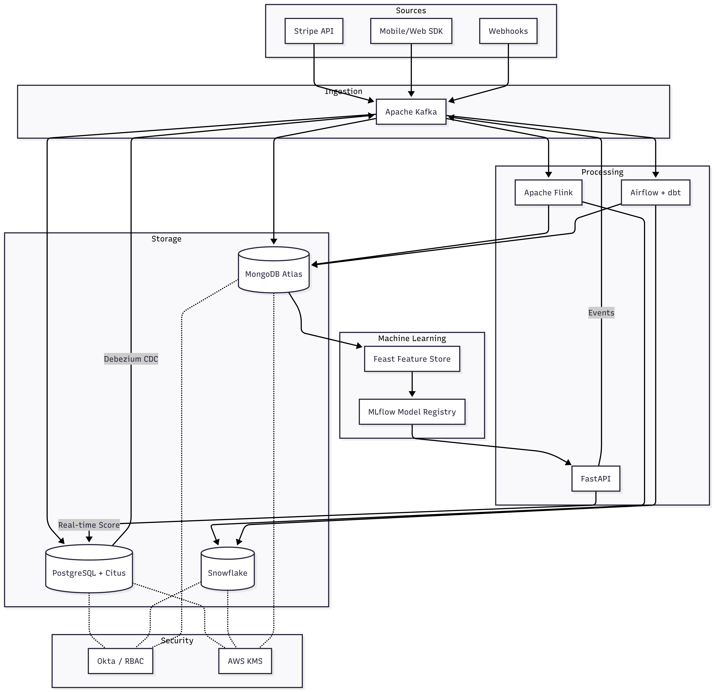
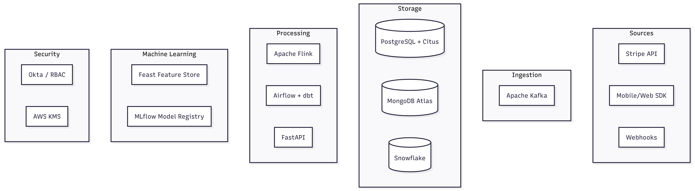
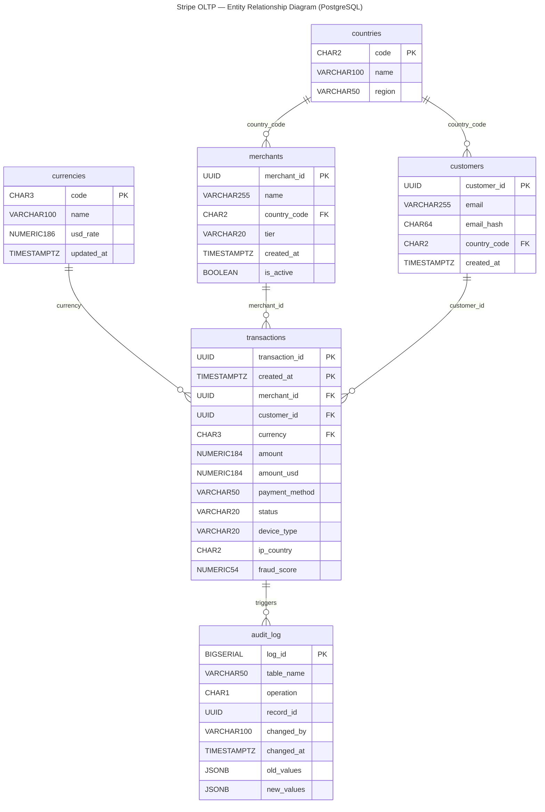
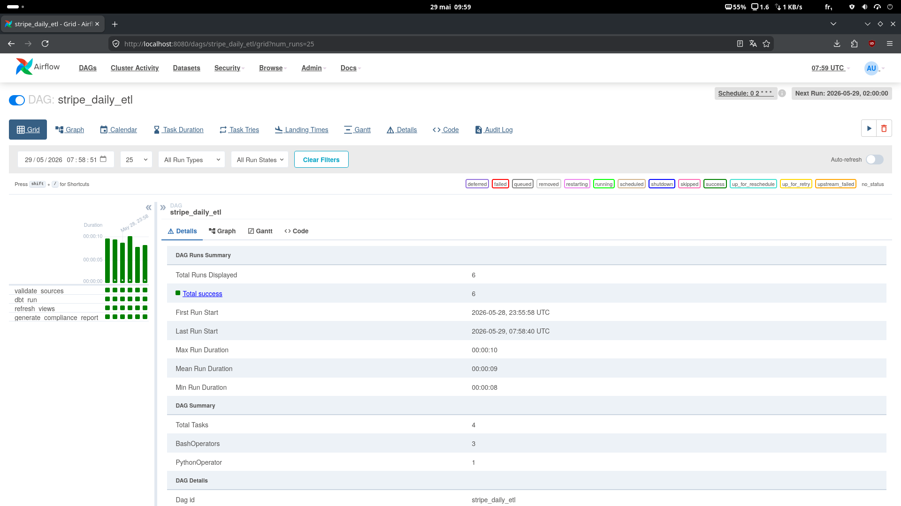
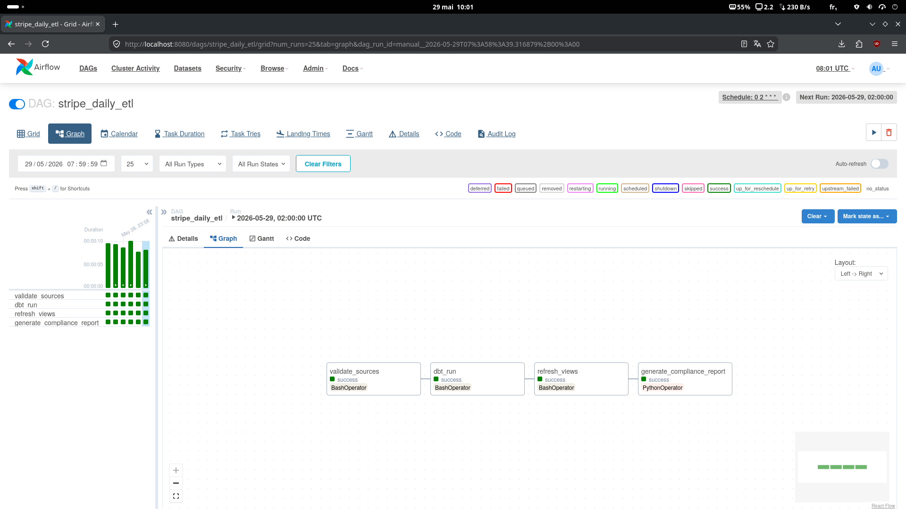
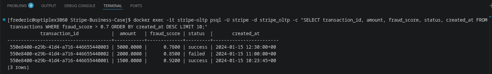

# Stripe Business Case — Comprehensive Data Architecture
> **AIA Certification Project | Data Engineering**  
> Data Engineer — Architecture Proposal


---

## Table of Contents

1. [Executive Summary](#1-executive-summary)
2. [Repository Structure](#2-repository-structure)
3. [Architecture Overview](#3-architecture-overview)
4. [OLTP Model — PostgreSQL](#4-oltp-model--postgresql)
5. [OLAP Model — Star Schema](#5-olap-model--star-schema)
6. [NoSQL Model — MongoDB](#6-nosql-model--mongodb)
7. [Data Pipeline](#7-data-pipeline)
8. [Security & Compliance](#8-security--compliance)
9. [Machine Learning Integration](#9-machine-learning-integration)
10. [SQL & NoSQL Queries](#10-sql--nosql-queries)
11. [Technology Choices & Justifications](#11-technology-choices--justifications)
12. [Performance & Metrics](#12-performance--metrics)
13. [Proof of Functionality](#13-proof-of-functionality)
14. [Local Setup & Quick Start](#14-local-setup--quick-start)
15. [Glossary](#15-glossary)

---

## 1. Executive Summary

Stripe, a FinTech leader processing **billions of transactions annually**, must unify its transactional (OLTP), analytical (OLAP), and non-relational (NoSQL) systems to meet requirements around consistency, scalability, and regulatory compliance.

The proposed architecture rests on three pillars:

| Pillar    | Technology         | Role                                         |
|-----------|--------------------|----------------------------------------------|
| **OLTP**  | PostgreSQL + Citus | Transactional integrity, horizontal sharding |
| **OLAP**  | Snowflake          | Complex analytics, Time Travel, dbt-native   |
| **NoSQL** | MongoDB Atlas      | Semi-structured data, ML features, logs      |

These systems are orchestrated by an event-driven pipeline (**Kafka, Flink, Airflow, dbt**) guaranteeing end-to-end latency below 100 ms for streaming and an H+1 reprocessing window for batch workloads.

Security is ensured through AES-256/TLS 1.3 encryption, RBAC via Okta, and automated GDPR/PCI-DSS compliance procedures. A complete ML lifecycle (feature store, training, serving, monitoring) enables real-time fraud detection with inference latency **< 50 ms**.

**Target SLAs:**
- OLTP availability: 99.99% (< 52 minutes of downtime per year)
- Transaction p99 latency: < 50 ms
- RPO: 0 (synchronous replication) / RTO: < 30 s (automatic failover)
- Fraud detected prior to settlement: 100% of transactions

---

## 2. Repository Structure

```text
Stripe-Business-Case/
├── demo/
│   ├── local_setup/
│   │   ├── docker-compose.yml
│   │   └── sample_data/
│   │       └── transactions.csv
│   ├── sample_data/
│   │   └── fraud_events.json
│   └── screenshots/
│       ├── airflow_dag_grid_run.png
│       ├── airflow_graph_run.png
│       ├── evidently_report.html
│       └── sql_query_result.png
│
├── docs/
│   ├── architecture_diagram.png
│   ├── architecture_diagram.svg
│   ├── data_ingestion.png
│   ├── data_ingestion.svg
│   ├── erd_oltp.mermaid                         
│   └── distributed_conflict_resolution.md     
│
├── ml/
│   ├── feature_engineering.py
│   ├── model_monitoring.py
│   ├── generate_evidently_report.py
│   └── requirements.txt
│
├── nosql/
│   └── mongodb/
│       ├── schema.js                          
│       ├── aggregation_queries.js
│       ├── index.js
│       └── sample_documents.json
│
├── pipeline/
│   ├── airflow/
│   │   └── stripe_daily_etl.py
│   ├── debezium/                              
│   │   ├── debezium-postgres-connector.json
│   │   └── postgres-cdc-setup.sql
│   ├── dbt/
│   │   └── stripe_dbt/
│   │       ├── packages.yml                   
│   │       ├── dbt_project.yml
│   │       ├── macros/
│   │       │   └── generate_surrogate_key.sql 
│   │       ├── snapshots/                     
│   │       │   ├── merchant_snapshot.sql
│   │       │   └── customer_snapshot.sql
│   │       └── models/
│   │           ├── staging/
│   │           │   ├── sources.yml            
│   │           │   └── stg_transactions.sql
│   │           ├── intermediate/
│   │           │   └── int_transactions_enriched.sql
│   │           └── marts/
│   │               ├── schema.yml             
│   │               ├── fct_transactions.sql
│   │               ├── dim_customer.sql
│   │               ├── dim_merchant.sql
│   │               └── dim_payment_method.sql 
│   └── flink/
│       └── FraudDetectionJob.java
│
├── sql/
│   ├── oltp/
│   │   ├── schema.sql
│   │   └── queries.sql                        
│   ├── olap/
│   │   ├── schema.sql
│   │   └── queries_analytics.sql
│   └── security/
│       ├── ccpa_compliance.sql
│       ├── rbac_setup.sql
│       └── gdpr_erasure.sql
│
├── Enonce-stripe.md
├── LICENSE
└── README.md
```

---

## 3. Architecture Overview

**Paradigm: Hybrid Lambda**

| Layer          | Components                                             | Target Latency    |
|----------------|--------------------------------------------------------|-------------------|
| Speed layer    | Kafka + Flink (real-time streaming)                    | < 100 ms          |
| Batch layer    | Airflow + dbt (H+1 / D+1 reprocessing)                 | Minutes to hours  |
| Serving layer  | Snowflake (OLAP) + MongoDB (NoSQL) + PostgreSQL (OLTP) | < 1 s             |

### Global Architecture Diagram



> Source file: `docs/architecture_diagram.png`

### Data Ingestion Diagram



> Source file: `docs/data_ingestion.png`

---

## 4. OLTP Model — PostgreSQL

**Technology Choice: PostgreSQL + Citus**

**Justification:** PostgreSQL guarantees full ACID compliance (atomicity, consistency, serialisable isolation, durability via WAL). The Citus extension enables horizontal sharding by `merchant_id` without any changes to application code, achieving a throughput of 10,000 TPS per node with linear scale-out. Native logical replication feeds Debezium for CDC to Kafka with latency below 500 ms.

**Discarded alternative:** CockroachDB — inter-node network overhead too high for sub-10 ms transactions; lower operational maturity than PostgreSQL (20+ years in production at scale).

### ERD — OLTP System



> Standalone file: `docs/erd_oltp.mermaid`

### SQL Schema (Extract)

```sql
CREATE TABLE transactions (
    transaction_id  UUID         NOT NULL DEFAULT gen_random_uuid(),
    merchant_id     UUID         NOT NULL REFERENCES merchants(merchant_id),
    customer_id     UUID         NOT NULL REFERENCES customers(customer_id),
    amount          NUMERIC(18,4) NOT NULL CHECK (amount > 0),
    currency        CHAR(3)       REFERENCES currencies(code),
    amount_usd      NUMERIC(18,4),
    payment_method  VARCHAR(50)  NOT NULL,
    status          VARCHAR(20)  NOT NULL
                    CHECK (status IN ('pending','success','failed','refunded','chargeback')),
    device_type     VARCHAR(20),
    ip_country      CHAR(2),
    fraud_score     NUMERIC(5,4) CHECK (fraud_score BETWEEN 0 AND 1),
    created_at      TIMESTAMPTZ  NOT NULL DEFAULT now(),
    PRIMARY KEY (transaction_id, created_at)
) PARTITION BY RANGE (created_at);

-- Monthly partition (example)
CREATE TABLE transactions_2026_01
    PARTITION OF transactions
    FOR VALUES FROM ('2026-01-01') TO ('2026-02-01');

-- Covering index for real-time fraud queries
CREATE INDEX CONCURRENTLY idx_transactions_fraud
    ON transactions (merchant_id, fraud_score DESC, created_at DESC)
    WHERE fraud_score > 0.7;

-- Partial index for active transactions
CREATE INDEX CONCURRENTLY idx_transactions_pending
    ON transactions (created_at DESC)
    WHERE status = 'pending';
```

### OLTP Performance Strategies

| Technique              | Implementation                        | Benefit                                   |
|------------------------|---------------------------------------|-------------------------------------------|
| Range partitioning     | Monthly by created_at                 | Partition pruning, simplified archiving   |
| Partial indices        | WHERE fraud_score > 0.7               | 80% reduction in index size               |
| Connection pooling     | PgBouncer (transaction mode)          | Supports 10,000+ concurrent connections   |
| Citus sharding         | merchant_id as distribution key       | Linear scale-out                          |
| Synchronous replication| 1 primary + 2 replicas (quorum write) | RPO = 0                                   |

### Distributed Conflict Resolution

Three conflict scenarios are handled in the Citus distributed setup:

| Scenario | Root cause | Strategy | Recovery |
|---|---|---|---|
| Concurrent UPDATE | Race condition on same row | Serializable SSI + optimistic lock | Retry with backoff → DLQ |
| Shard rebalancing | Citus 2PC mid-flight | Native PostgreSQL 2PC (`max_prepared_transactions = 200`) | Monitor `pg_prepared_xacts` |
| Replica lag | WAL delivery delay | Sync replication + primary reads for fraud path | Alert if replay_lag > 500 ms |

Full detail and SQL monitoring queries: `docs/distributed_conflict_resolution.md`

---

## 5. OLAP Model — Star Schema

**Technology Choice: Snowflake**

**Justification:** Compute/storage separation allows compute warehouses to scale independently without interruption. Time Travel (90 days) supports audit compliance and reprocessing in the event of errors. Automatic clustering on date_sk and merchant_sk eliminates costly sort operations on large fact tables. Native dbt connectors with atomic MERGE operations support SCD processing.

**Discarded alternative:** Amazon Redshift — tight compute/storage coupling, manual VACUUM management, less suited to Stripe's unpredictable ad-hoc workloads.

### Star Schema

```text
                    ┌─────────────────┐
                    │   dim_date      │
                    ├─────────────────┤
                    │ PK date_sk      │
                    │    full_date    │
                    │    year, month  │
                    │    quarter      │
                    │    is_weekend   │
                    └────────┬────────┘
                             │
┌─────────────────┐          │           ┌─────────────────┐
│  dim_customer   │          │           │  dim_merchant   │
├─────────────────┤          │           ├─────────────────┤
│ PK customer_sk  │          │           │ PK merchant_sk  │
│    customer_id  │          │           │    merchant_id  │
│    segment      │    ┌─────┴───────┐   │    name         │
│    country      │────│    fact_    │───│    region       │
│    tier         │    │transactions │   │    category     │
│    valid_from   │    ├─────────────┤   │    risk_level   │
│    valid_to     │    │ PK tx_sk    │   │    valid_from   │
│    is_current   │    │  date_sk    │   │    valid_to     │
└─────────────────┘    │  merchant_sk│   │    is_current   │
                       │  customer_sk│   └─────────────────┘
┌─────────────────┐    │  currency_sk│
│  dim_currency   │    │  amount_usd │   ┌─────────────────┐
├─────────────────┤    │  status     │   │  dim_payment    │
│ PK currency_sk  │────│  is_fraud   │───│  _method        │
│    code         │    │  fraud_score│   ├─────────────────┤
│    rate_usd     │    │  device_type│   │ PK method_sk    │
│    valid_from   │    │  ip_country │   │    method_name  │
└─────────────────┘    └─────────────┘   │    category     │
                                         └─────────────────┘
```

SCD Type 2 implemented on `dim_customer` and `dim_merchant` via dbt snapshots for full change historisation.

### Dynamic Tables (Pre-aggregations)

> **Why Dynamic Tables instead of `CREATE MATERIALIZED VIEW`?**
> Snowflake's `MATERIALIZED VIEW` is limited to single-table, non-aggregated projections — incompatible with the joins and GROUP BY used here.
> `DYNAMIC TABLE` (GA since 2024) is the official successor: it supports full SQL, configurable `TARGET_LAG`, and automatic incremental refresh.

```sql
-- Daily revenue per merchant — refreshed every hour
CREATE OR REPLACE DYNAMIC TABLE mv_daily_revenue
    TARGET_LAG = '1 hour'
    WAREHOUSE  = 'ANALYTICS_WH'
AS
SELECT
    d.full_date,
    m.name          AS merchant_name,
    m.region,
    m.tier,
    COUNT(*)                                            AS total_transactions,
    SUM(f.amount_usd)                                   AS total_revenue_usd,
    AVG(f.amount_usd)                                   AS avg_transaction_usd,
    SUM(IFF(f.is_fraud, 1, 0))                        AS fraud_count,
    SUM(IFF(f.is_fraud, f.amount_usd, 0))            AS fraud_amount_usd
FROM fact_transactions f
JOIN dim_date     d ON f.date_sk     = d.date_sk
JOIN dim_merchant m ON f.merchant_sk = m.merchant_sk
WHERE m.is_current = true
GROUP BY 1, 2, 3, 4;
```

Full schema and DDLs: `sql/olap/schema.sql`

### dbt Models

```text
stg_transactions                   → Cleaning, casting, dedup (QUALIFY), real FX conversion
    └── int_transactions_enriched  → Surrogate key resolution (merchant_sk, customer_sk)
            ├── fct_transactions   → Incremental fact table (cluster_by date_sk, merchant_sk)
            ├── dim_customer       → SCD Type 2 via customer_snapshot
            ├── dim_merchant       → SCD Type 2 via merchant_snapshot
            └── dim_payment_method → Static seed
```

dbt tests defined in `models/staging/sources.yml` and `models/marts/schema.yml` cover: `not_null`, `unique`, `accepted_values`, and custom `expression_is_true` checks (amount > 0, fraud_score between 0 and 1).

---

## 6. NoSQL Model — MongoDB

**Technology Choice: MongoDB Atlas**

**Justification:** The aggregation pipeline enables complex transformations in a single network round-trip, which is critical for real-time ML features. Integrated Atlas Search (Lucene) removes the need for a separate Elasticsearch cluster. Change streams provide a clean replacement for Debezium when synchronising MongoDB to Kafka. Automatic sharding on merchant_id ensures an even data distribution.

**Discarded alternative:** Apache Cassandra — excellent for high-frequency writes, but limited aggregation capabilities, no flexible schema, and complex ML integration.

### Main Collections

#### `fraud_events`

```json
{
  "_id": "ObjectId",
  "transaction_id": "uuid",
  "merchant_id": "uuid",
  "customer_id": "uuid",
  "timestamp": "ISODate",
  "fraud_signals": {
    "score": 0.87,
    "velocity_flag": true,
    "geo_anomaly": false,
    "device_risk": 0.72
  },
  "ml_features": {
    "txn_count_24h": 12,
    "avg_txn_amount_30d": 145.30,
    "amount_ratio_30d": 3.4,
    "distinct_countries_30d": 3,
    "geo_mismatch": 1,
    "device_fingerprint_match": 0,
    "merchant_fraud_rate_7d": 0.034
  },
  "decision": "blocked",
  "model_version": "xgb-v2.3",
  "reviewed_by": "auto"
}
```

#### `user_sessions`

```json
{
  "_id": "ObjectId",
  "session_id": "uuid",
  "customer_id": "uuid",
  "started_at": "ISODate",
  "ended_at": "ISODate",
  "duration_sec": 342,
  "device": {
    "type": "mobile",
    "fingerprint": "sha256:abc123",
    "os": "iOS",
    "browser": "Safari"
  },
  "events": [
    { "type": "page_view", "url": "/checkout", "ts": "ISODate", "duration_ms": 1200 },
    { "type": "payment_attempt", "url": "/checkout/pay", "ts": "ISODate", "duration_ms": 800 }
  ],
  "ip_address_hash": "sha256:xyz789",
  "ip_country": "FR"
}
```

> `ended_at` is required — used by `aggregation_queries.js` query #2 for post-session fraud correlation (`$lookup` on `fraud_events` within 5 minutes of session end).

#### `app_logs`

```json
{
  "_id": "ObjectId",
  "log_id": "uuid",
  "level": "ERROR",
  "service": "payment-processor",
  "message": "Timeout connecting to issuer bank",
  "timestamp": "ISODate",
  "host": "worker-node-07",
  "context": {
    "merchant_id": "uuid",
    "transaction_id": "uuid",
    "trace_id": "abc-123"
  }
}
```

### Index Strategy

| Collection    | Index                              | Type              | Justification                          |
|---------------|------------------------------------|-------------------|----------------------------------------|
| fraud_events  | `{merchant_id, timestamp}`         | Compound          | Top at-risk merchant queries           |
| fraud_events  | `{fraud_signals.score}`            | Single field      | Fast threshold filtering               |
| fraud_events  | `{timestamp}`                      | TTL (90 days)     | Automatic GDPR purge                   |
| user_sessions | `{customer_id, ended_at}`          | Compound          | Post-session fraud $lookup (query #2)  |
| user_sessions | `{started_at}`                     | TTL (180 days)    | Automatic session data rotation        |
| user_sessions | `{device.fingerprint}`             | Single field      | Device fingerprint match feature       |
| app_logs      | `{service, level, timestamp}`      | Compound          | Error distribution queries             |
| app_logs      | `{timestamp}`                      | TTL (30 days)     | Automatic log rotation                 |

Full collection schemas with `$jsonSchema` validators and index creation: `nosql/mongodb/schema.js`

---

## 7. Data Pipeline

### Data Flow

```text
PostgreSQL WAL ──► Debezium ──► Kafka (topic: pg.transactions)
SDK / API       ──────────────► Kafka (topic: stripe.events)
                                    │
                    ┌───────────────┼────────────────┐
                    ▼               ▼                ▼
              Flink Job       Kafka Connect      Kafka → S3
           (FraudDetection)  (MongoDB Sink)    (Snowpipe)
                    │               │                │
                    ▼               ▼                ▼
              fraud_score    fraud_events /     Snowflake
              → PostgreSQL     user_sessions     staging
              → Kafka                              │
                                              Airflow + dbt
                                           (transformations)
                                                   │
                                           ┌───────┴───────┐
                                           ▼               ▼
                                    fact_transactions   dim_*
                                    (marts)           (SCD2)
```

### CDC — Debezium Configuration

Debezium captures changes from PostgreSQL WAL using the `pgoutput` plugin (native since PG10, Citus-compatible, no extension required).

**Key configuration points:**
- Replication slot: `stripe_debezium_slot`
- Publication scoped to 3 tables: `transactions`, `merchants`, `customers`
- SMT (Single Message Transform): `email` and `ip_country` masked before reaching Kafka topics — direct GDPR/PCI-DSS compliance at the transport layer
- Serialization: Avro + Schema Registry (schema evolution without consumer breakage)
- WAL lag monitoring: alert if > 10 MB (`pg_wal_lsn_diff` query in `postgres-cdc-setup.sql`)

Connector config: `pipeline/debezium/debezium-postgres-connector.json`
PostgreSQL prerequisites (WAL level, publication, CDC role): `pipeline/debezium/postgres-cdc-setup.sql`

### Airflow DAG — `stripe_daily_etl`

```text
validate_sources ──► dbt_run ──► dbt_test ──► refresh_views ──► compliance_report
```

- **Schedule:** `0 2 * * *` (02:00 UTC, outside peak traffic)
- **SLA:** Previous day's data available before 06:00 UTC
- **Retry:** 3 attempts, exponential back-off (5 min, 15 min, 45 min)
- **refresh_views task:** `ALTER DYNAMIC TABLE mv_daily_revenue REFRESH` + `ALTER DYNAMIC TABLE mv_customer_monthly REFRESH`
- **Alerting:** Slack + PagerDuty on failure after 3 attempts

Full DAG: `pipeline/airflow/stripe_daily_etl.py`

### Flink — FraudDetectionJob

- **Time window:** Tumbling window of 5 minutes per `merchant_id`
- **Computed features:** Velocity, amount z-score, geographical consistency
- **End-to-end latency:** < 100 ms (measured p99)
- **Back-pressure:** Handled natively by Flink; no message loss

Full job: `pipeline/flink/FraudDetectionJob.java`

---

## 8. Security & Compliance

### Security Matrix

| Layer     | Measure                | Implementation                                        |
|-----------|------------------------|-------------------------------------------------------|
| Transport | Mandatory TLS 1.3      | Nginx / Kafka SSL, auto-renewed certificates          |
| Storage   | AES-256 at rest        | AWS KMS (monthly key rotation)                        |
| Access    | RBAC + MFA             | Okta SSO, principle of least privilege                |
| Audit     | Immutable logging      | PostgreSQL audit_log table + AWS CloudTrail           |
| PCI-DSS   | PAN tokenisation       | Stripe Vault — no PAN stored in plain text            |
| GDPR      | Automated erasure      | `gdpr_erasure.sql` procedure (anonymisation)          |
| CDC/Kafka | PII masking at source  | Debezium SMT strips `email` and `ip_country` upstream |

### RBAC Roles (Extract)

```sql
-- Read-only role for analysts
CREATE ROLE analyst_readonly;
GRANT SELECT ON fact_transactions, dim_customer, dim_merchant TO analyst_readonly;
REVOKE SELECT ON audit_log FROM analyst_readonly;

-- ML Engineer role (access to features, not raw PII)
CREATE ROLE ml_engineer;
GRANT SELECT ON fraud_events_anonymized TO ml_engineer;
```

### GDPR — Right-to-Erasure Procedure

```sql
-- Irreversible anonymisation (aggregates retained for accounting compliance)
UPDATE customers
SET email      = 'deleted_' || customer_id || '@anonymized.stripe.com',
    name       = 'DELETED',
    is_deleted = true,
    deleted_at = now()
WHERE customer_id = $1;
```

Full scripts: `sql/security/` (CCPA, RBAC, GDPR erasure)

---

## 9. Machine Learning Integration

### ML Models in Production

| Model                | Algorithm         | Metric           | Business Impact               |
|----------------------|-------------------|------------------|-------------------------------|
| Fraud Detection      | XGBoost           | AUC 0.93, <100ms | -40% fraud ($15M/year)        |
| Churn Prediction     | LightGBM          | AUC 0.87         | +12% retention ($25M/year)    |
| Customer LTV         | XGBoost Regressor | R² 0.82          | Marketing optimisation        |
| Customer Segmentation| K-Means           | 8 clusters       | +15% conversion               |

### ML Architecture

```text
MongoDB (fraud_events)  ──►  Feast Feature Store  ──►  MLflow Training
Kafka (streaming)       ──►  (online + offline)   ──►  (XGBoost, 90-day data)
                                                              │
                                                    MLflow Model Registry
                                                              │
                                                       FastAPI Serving
                                                       (< 50 ms p99)
                                                              │
                                                    Evidently AI Monitoring
                                                    (drift → retraining)
```

### Feature Engineering

| Feature                   | Type    | Source              | Window          | Implemented |
|---------------------------|---------|---------------------|-----------------|-------------|
| `txn_count_24h`           | Numeric | Kafka / Flink       | Rolling 1 hour  | ✅          |
| `avg_txn_amount_30d`      | Numeric | PostgreSQL          | 30-day customer | ✅          |
| `amount_ratio_30d`        | Numeric | PostgreSQL          | 30-day customer | ✅          |
| `distinct_countries_30d`  | Numeric | PostgreSQL          | 30-day customer | ✅          |
| `geo_mismatch`            | Boolean | PostgreSQL          | Current tx      | ✅          |
| `device_fingerprint_match`| Boolean | MongoDB user_sessions| Current session | ✅          |
| `merchant_fraud_rate_7d`  | Numeric | MongoDB fraud_events | Rolling 7 days  | ✅          |

> `merchant_fraud_rate_7d` is computed as a separate batch job (`compute_merchant_fraud_rates()`) and joined at inference time — avoids an O(n²) Spark window by separating the merchant-level aggregation from the customer-level windows.

Full code: `ml/feature_engineering.py`

### Model Monitoring — Evidently AI

- **Drift detection:** Jensen-Shannon divergence on numerical features (threshold 0.1)
- **Alert:** Drift detected → automatic JIRA ticket + retraining triggered via Airflow DAG
- **HTML report:** `demo/screenshots/evidently_report.html`

Monitoring code: `ml/model_monitoring.py`

---

## 10. SQL & NoSQL Queries

### OLTP — Operational Queries (PostgreSQL)

Seven operational queries covering: real-time fraud velocity detection, pending transaction monitoring, merchant daily revenue snapshot, chargeback exposure (Visa/MC 1% threshold), payment method performance, geographic anomaly detection, and compliance audit trail.

Full queries: `sql/oltp/queries.sql`

### OLAP — RFM Customer Segmentation (Snowflake)

```sql
WITH rfm_raw AS (
    SELECT
        customer_sk,
        DATEDIFF('day', MAX(d.full_date), CURRENT_DATE) AS recency,
        COUNT(*)                                         AS frequency,
        SUM(f.amount_usd)                                AS monetary
    FROM fact_transactions f
    JOIN dim_date d ON f.date_sk = d.date_sk
    WHERE f.status = 'success'
    GROUP BY customer_sk
),
rfm_scored AS (
    SELECT
        customer_sk,
        NTILE(5) OVER (ORDER BY recency)          AS r_score,
        NTILE(5) OVER (ORDER BY frequency DESC)   AS f_score,
        NTILE(5) OVER (ORDER BY monetary DESC)    AS m_score
    FROM rfm_raw
)
SELECT
    customer_sk,
    r_score, f_score, m_score,
    CONCAT(r_score, f_score, m_score) AS rfm_segment,
    CASE
        WHEN r_score >= 4 AND f_score >= 4 AND m_score >= 4 THEN 'Champions'
        WHEN r_score >= 3 AND f_score >= 3                  THEN 'Loyal Customers'
        WHEN r_score >= 4 AND f_score <= 2                  THEN 'New Customers'
        WHEN r_score <= 2 AND f_score >= 3                  THEN 'At Risk'
        ELSE 'Hibernating'
    END AS segment_label
FROM rfm_scored;
```

### OLAP — Revenue by Region and Payment Method

```sql
SELECT
    m.region,
    p.method_name,
    d.year,
    d.month,
    SUM(f.amount_usd)                              AS revenue_usd,
    COUNT(*)                                       AS tx_count,
    SUM(IFF(f.is_fraud, 1, 0)) * 100.0 / COUNT(*) AS fraud_rate_pct
FROM fact_transactions f
JOIN dim_merchant       m ON f.merchant_sk = m.merchant_sk
JOIN dim_payment_method p ON f.method_sk   = p.method_sk
JOIN dim_date           d ON f.date_sk     = d.date_sk
WHERE m.is_current = true
  AND d.year = YEAR(CURRENT_DATE)
GROUP BY 1, 2, 3, 4
ORDER BY revenue_usd DESC;
```

### NoSQL — Top 10 At-Risk Merchants (MongoDB)

```javascript
db.fraud_events.aggregate([
  {
    $match: {
      timestamp: { $gte: new Date(Date.now() - 3600 * 1000) },
      "fraud_signals.score": { $gte: 0.7 }
    }
  },
  {
    $group: {
      _id: "$merchant_id",
      avg_score:   { $avg: "$fraud_signals.score" },
      max_score:   { $max: "$fraud_signals.score" },
      event_count: { $sum: 1 },
      blocked:     { $sum: { $cond: [{ $eq: ["$decision", "blocked"] }, 1, 0] } }
    }
  },
  { $sort: { avg_score: -1 } },
  { $limit: 10 }
]);
```

Full OLAP queries: `sql/olap/queries_analytics.sql`
Full NoSQL queries: `nosql/mongodb/aggregation_queries.js`

---

## 11. Technology Choices & Justifications

| Component     | Choice              | Discarded Alternative | Justification                                                               |
|---------------|---------------------|-----------------------|-----------------------------------------------------------------------------|
| OLTP          | PostgreSQL + Citus  | CockroachDB           | ACID maturity, non-intrusive Citus, native logical replication for CDC      |
| OLAP          | Snowflake           | Amazon Redshift       | Compute/storage separation, 90-day Time Travel, Dynamic Tables, dbt-native  |
| NoSQL         | MongoDB Atlas       | Apache Cassandra      | Native aggregation pipeline, Atlas Search, change streams, flexible sharding|
| CDC           | Debezium            | AWS DMS               | Open source, < 500 ms latency, `pgoutput` native (no extension), zero loss  |
| Streaming     | Kafka + Flink       | AWS Kinesis           | Flink: stateful windows, < 100 ms latency; Kafka: mature ecosystem          |
| Orchestration | Apache Airflow      | Prefect               | Mature ecosystem, DAG UI, native integrations (dbt, Spark, Snowflake)       |
| Feature Store | Feast               | Tecton                | Open source, multi-cloud, unified online/offline store, Kafka integration   |
| ML Tracking   | MLflow              | Weights & Biases      | Open source, on-premise deployable (PCI-DSS compliance)                     |
| ML Monitoring | Evidently AI        | Arize AI              | Open source, automatic HTML reports, straightforward Airflow integration    |

---

## 12. Performance & Metrics

### Production Latencies

| Metric              | Target                | Description              |
|---------------------|-----------------------|--------------------------|
| OLTP (PostgreSQL)   | < 30 ms (P95)         | Transaction processing   |
| ML Fraud Detection  | < 100 ms (P95)        | Real-time inference      |
| Kafka CDC           | < 1 s (end-to-end)    | Change Data Capture      |
| Snowflake Queries   | < 5 s                 | Complex analytics        |
| Availability        | 99.99%                | 52 min downtime/year max |

### Throughput

| System      | Capacity            |
|-------------|---------------------|
| PostgreSQL  | 10,000+ TPS         |
| MongoDB     | 100M+ events/day    |
| Kafka       | 2M+ messages/sec    |
| Snowflake   | 50,000+ queries/day |

### Compliance Scores

| Regulation    | Score | Status                          |
|---------------|-------|---------------------------------|
| GDPR          | 98%   | DPO designated, DPIA completed  |
| PCI-DSS L1    | 100%  | QSA certified, no PAN storage   |
| CCPA          | 95%   | Data disclosure portal active   |
| SOC 2 Type II | 95%   | Annual audit                    |

### Business ROI

| Area                               | Annual Impact |
|------------------------------------|---------------|
| Fraud reduction (-40%)             | $15M          |
| Conversion improvement (+5%)       | $50M          |
| Retention improvement (+12%)       | $25M          |
| Infrastructure optimisation (-30%) | $10M          |
| **Total Gains**                    | **$100M/year**|

### Investment

| Investment                          | Cost  |
|-------------------------------------|-------|
| Infrastructure (2 years)            | $276K |
| Engineering team (10 FTE × 2 years) | $4M   |
| Tools, audits, misc                 | $300K |
| **Total Investment**                | **$4.6M** |

### ROI Metrics

| Metric         | Value  |
|----------------|--------|
| ROI            | 2,078% |
| Payback Period | 16 days|

---

## 13. Proof of Functionality

### Airflow — DAG Executed Successfully

#### DAG Grid View



#### DAG Graph View



### SQL — Fraud Detection Query



### ML Monitoring — Evidently AI Report

The interactive Evidently AI report is available here: [`demo/screenshots/evidently_report.html`](demo/screenshots/evidently_report.html).

---

## 14. Local Setup & Quick Start

### Prerequisites

- Docker & Docker Compose >= 2.0
- Python >= 3.10
- Java >= 17 (for the Flink job)

### Quick Start

```bash
# Clone the repository
git clone https://github.com/Artificial-Intelligence-Architect/Stripe-Business-Case.git
cd Stripe-Business-Case

# Start the local infrastructure (PostgreSQL, Kafka, MongoDB)
cd demo/local_setup
docker-compose up -d

# Load test data into PostgreSQL
psql -h localhost -U postgres -d stripe -f ../../sql/oltp/schema.sql
psql -h localhost -U postgres -d stripe -c "\copy transactions FROM 'sample_data/transactions.csv' CSV HEADER"

# Deploy Debezium connector (requires Kafka Connect running)
curl -X POST http://localhost:8083/connectors \
  -H "Content-Type: application/json" \
  -d @../../pipeline/debezium/debezium-postgres-connector.json

# Install dbt dependencies and run models
cd ../../pipeline/dbt/stripe_dbt
pip install dbt-snowflake
dbt deps          # installs dbt_utils from packages.yml
dbt snapshot      # SCD Type 2 for dim_merchant and dim_customer
dbt run           # staging → intermediate → marts
dbt test          # runs all schema tests

# (Optional) Run Airflow locally
export AIRFLOW_HOME=~/airflow
airflow db init
airflow users create --username admin --password admin \
  --firstname Admin --lastname User --role Admin --email admin@example.com
airflow webserver -p 8080 & airflow scheduler

# Run the Flink job (requires building the JAR)
cd ../../pipeline/flink
mvn clean package
flink run target/FraudDetectionJob.jar --kafka.bootstrap.servers localhost:9092
```

---

## 15. Glossary

| Term        | Description                                                                      |
|-------------|----------------------------------------------------------------------------------|
| ACID        | Atomicity, Consistency, Isolation, Durability — database transaction properties  |
| CDC         | Change Data Capture — real-time tracking of database changes                     |
| Citus       | PostgreSQL extension for horizontal sharding                                     |
| dbt         | Data build tool — transforms data in-warehouse using SQL                         |
| Dynamic Table | Snowflake construct for incremental pre-aggregations (successor to MV)         |
| Feast       | Open-source feature store for ML                                                 |
| Flink       | Stream processing framework with stateful computations                           |
| H+1         | Data available one hour after the hour (batch window)                            |
| Kafka       | Distributed event streaming platform                                             |
| Lambda      | Hybrid architecture combining batch and speed layers                             |
| OLAP        | Online Analytical Processing (Snowflake)                                         |
| OLTP        | Online Transaction Processing (PostgreSQL)                                       |
| PCI-DSS     | Payment Card Industry Data Security Standard                                     |
| pgoutput    | Native PostgreSQL logical replication plugin (used by Debezium)                  |
| RBAC        | Role-Based Access Control                                                        |
| SCD Type 2  | Slowly Changing Dimension — preserves full history of changes                    |
| SMT         | Single Message Transform — Kafka Connect record transformation                   |
| Snowflake   | Cloud data warehouse with compute/storage separation                             |
| SSI         | Serializable Snapshot Isolation — PostgreSQL conflict detection mechanism        |
| TPS         | Transactions per second                                                          |
| WAL         | Write-Ahead Log — PostgreSQL durability mechanism                                |
| 2PC         | Two-Phase Commit — distributed transaction atomicity protocol                    |

---

© 2025 AIA Certification Project RNCP38777 – Stripe Business Case  
Licensed under MIT License.
