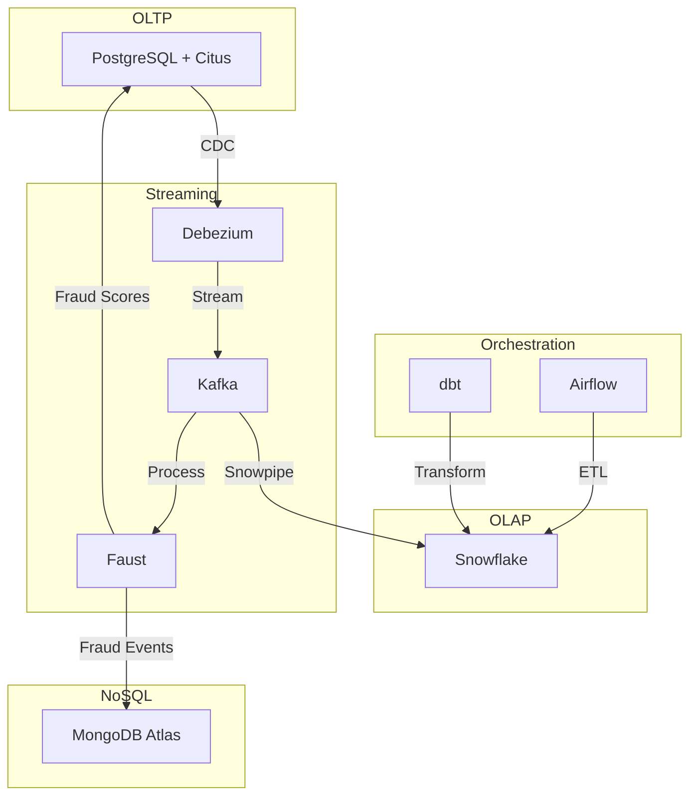
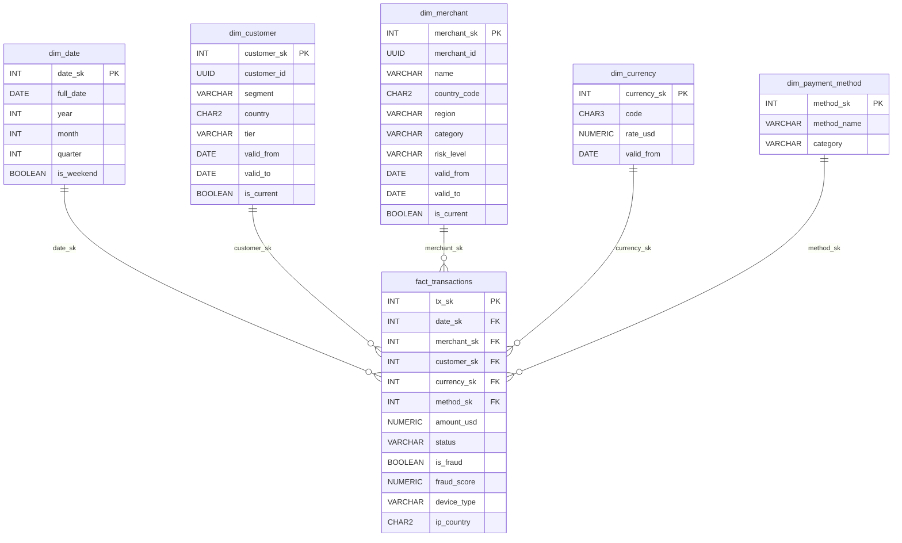
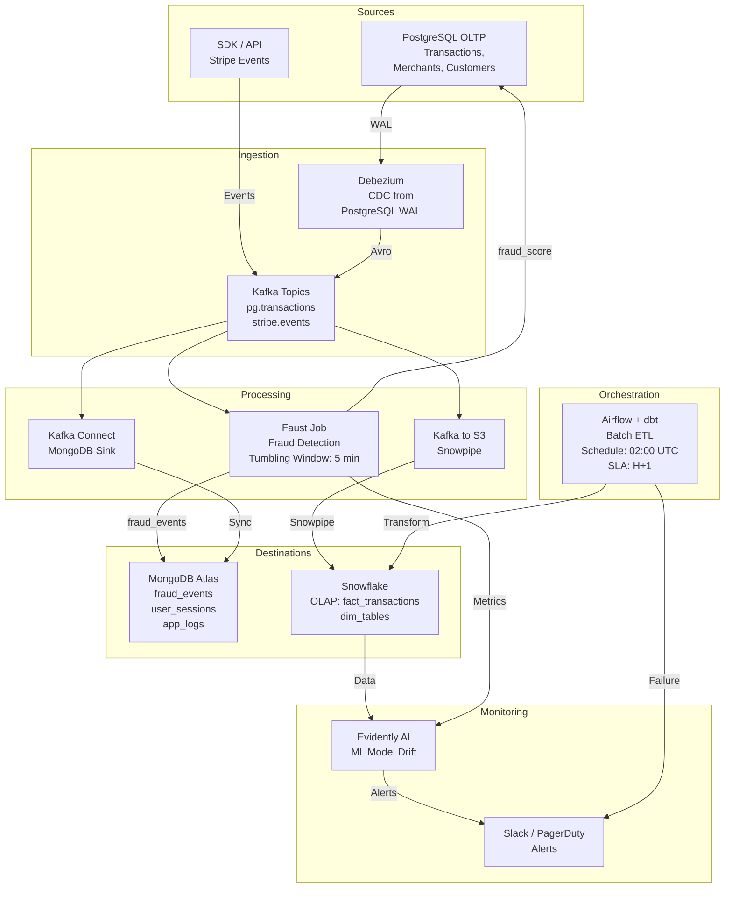

# Stripe Business Case — Comprehensive Data Architecture

> **AIA Certification Project | Data Engineering**
> **Data Engineer — Architecture Proposal**

--- 

## 📌 Table of Contents

1. [Executive Summary](#executive-summary)
2. [Repository Structure](#repository-structure)
3. [Architecture Overview](#architecture-overview)
4. [OLTP Model — PostgreSQL](#oltp-model--postgresql)
5. [OLAP Model — Star Schema](#olap-model--star-schema)
6. [NoSQL Model — MongoDB](#nosql-model--mongodb)
7. [Data Pipeline](#data-pipeline)
8. [Security & Compliance](#security--compliance)
9. [Machine Learning Integration](#machine-learning-integration)
10. [SQL & NoSQL Queries](#sql--nosql-queries)
11. [Technology Choices & Justifications](#technology-choices--justifications)
12. [Performance & Metrics](#performance--metrics)
13. [Proof of Functionality](#proof-of-functionality)
14. [Local Setup & Quick Start](#local-setup--quick-start)
15. [Deployment Guide](#deployment-guide)
16. [Glossary](#glossary)

--- 

## 🎯 Executive Summary

Stripe, a FinTech leader processing **billions of transactions annually**, must unify its transactional (OLTP), analytical (OLAP), and non-relational (NoSQL) systems to meet requirements around consistency, scalability, and regulatory compliance.

The proposed architecture rests on three pillars:

| Pillar    | Technology         | Role                                         |
|-----------|--------------------|----------------------------------------------|
| **OLTP**  | PostgreSQL + Citus | Transactional integrity, horizontal sharding |
| **OLAP**  | Snowflake          | Complex analytics, Time Travel, dbt-native   |
| **NoSQL** | MongoDB Atlas      | Semi-structured data, ML features, logs      |

These systems are orchestrated by an event-driven pipeline (**Kafka, Faust, Airflow, dbt**) guaranteeing end-to-end latency below 100 ms for streaming and an H+1 reprocessing window for batch workloads.

Security is ensured through AES-256/TLS 1.3 encryption, RBAC via Okta, and automated GDPR/PCI-DSS compliance procedures. A complete ML lifecycle (feature store, training, serving, monitoring) enables real-time fraud detection with inference latency **< 50 ms**.

**Target SLAs:**
- OLTP availability: 99.99% (< 52 minutes of downtime per year)
- Transaction p99 latency: < 50 ms
- RPO: 0 (synchronous replication) / RTO: < 30 s (automatic failover)
- Fraud detected prior to settlement: 100% of transactions

--- 

## 📁 Repository Structure

```
Stripe-Business-Case/
├── demo/
│   ├── local_setup/
│   │   ├── docker-compose.yml
│   │   ├── docker-compose-kafka.yml
│   │   ├── docker-compose-airflow.yml
│   │   └── sample_data/
│   │       ├── transactions.csv
│   │       └── fraud_events.json
│   ├── sample_data/
│   │   └── fraud_events.json
│   └── screenshots/
│       ├── airflow_dag_grid_run.png
│       ├── airflow_graph_run.png
│       ├── evidently_report.html
│       └── sql_query_result.png
│
├── docs/
│   ├── architecture_diagram.png
│   ├── architecture_diagram.svg
│   ├── data_ingestion.png
│   ├── data_ingestion.svg
│   ├── erd_oltp.mermaid
│   ├── erd_olap.mermaid
│   ├── data_pipeline.mermaid
│   ├── technological_alternatives.md
│   ├── deployment_guide.md
│   └── distributed_conflict_resolution.md
│
├── ml/
│   ├── feature_engineering.py
│   ├── model_monitoring.py
│   ├── generate_evidently_report.py
│   └── requirements.txt
│
├── nosql/
│   └── mongodb/
│       ├── mongodb_schema.py
│       ├── mongodb_aggregation_queries.py
│       ├── mongodb_indexes.py
│       └── sample_documents.json
│
├── pipeline/
│   ├── airflow/
│   │   └── stripe_daily_etl.py
│   ├── debezium/
│   │   ├── debezium-postgres-connector.json
│   │   └── postgres-cdc-setup.sql
│   ├── dbt/
│   │   └── stripe_dbt/
│   │       ├── packages.yml
│   │       ├── dbt_project.yml
│   │       ├── macros/
│   │       │   └── generate_surrogate_key.sql
│   │       ├── snapshots/
│   │       │   ├── merchant_snapshot.sql
│   │       │   └── customer_snapshot.sql
│   │       └── models/
│   │           ├── staging/
│   │           │   ├── sources.yml
│   │           │   └── stg_transactions.sql
│   │           ├── intermediate/
│   │           │   └── int_transactions_enriched.sql
│   │           └── marts/
│   │               ├── schema.yml
│   │               ├── fct_transactions.sql
│   │               ├── dim_customer.sql
│   │               ├── dim_merchant.sql
│   │               └── dim_payment_method.sql
│   └── flink/
│       └── fraud_detection_job.py
│
├── sql/
│   ├── oltp/
│   │   ├── schema.sql
│   │   └── queries.sql
│   ├── olap/
│   │   ├── schema.sql
│   │   └── queries_analytics.sql
│   └── security/
│       ├── ccpa_compliance.sql
│       ├── rbac_setup.sql
│       └── gdpr_erasure.sql
│
├── .env.example
├── .gitignore
├── LICENSE
└── README.md
```

--- 

## 🏗️ Architecture Overview

**Paradigm: Hybrid Lambda**

| Layer          | Components                                             | Target Latency   |
|----------------|--------------------------------------------------------|------------------|
| Speed layer    | Kafka + Faust (real-time streaming)                    | < 100 ms         |
| Batch layer    | Airflow + dbt (H+1 / D+1 reprocessing)                 | Minutes to hours |
| Serving layer  | Snowflake (OLAP) + MongoDB (NoSQL) + PostgreSQL (OLTP) | < 1 s            |

### 📊 Architecture Diagrams

#### Global Architecture Diagram


#### OLAP Star Schema (ERD)


#### Data Pipeline Diagram


--- 

## 🗃️ OLTP Model — PostgreSQL

**Technology Choice: PostgreSQL + Citus**

**Justification:** PostgreSQL guarantees full ACID compliance (atomicity, consistency, serialisable isolation, durability via WAL). The Citus extension enables horizontal sharding by `merchant_id` without any changes to application code, achieving a throughput of 10,000 TPS per node with linear scale-out. Native logical replication feeds Debezium for CDC to Kafka with latency below 500 ms.

**Discarded alternative:** CockroachDB — inter-node network overhead too high for sub-10 ms transactions; lower operational maturity than PostgreSQL (20+ years in production at scale).

### ERD — OLTP System
> Standalone file: [ERD OLTP (Mermaid)](docs/erd_oltp.mermaid)

### SQL Schema (Extract)
```sql
CREATE TABLE transactions (
    transaction_id  UUID         NOT NULL DEFAULT gen_random_uuid(),
    merchant_id     UUID         NOT NULL REFERENCES merchants(merchant_id),
    customer_id     UUID         NOT NULL REFERENCES customers(customer_id),
    amount          NUMERIC(18,4) NOT NULL CHECK (amount > 0),
    currency        CHAR(3)       REFERENCES currencies(code),
    amount_usd      NUMERIC(18,4),
    payment_method  VARCHAR(50)  NOT NULL,
    status          VARCHAR(20)  NOT NULL
                    CHECK (status IN ('pending','success','failed','refunded','chargeback')),
    device_type     VARCHAR(20),
    ip_country      CHAR(2),
    fraud_score     NUMERIC(5,4) CHECK (fraud_score BETWEEN 0 AND 1),
    created_at      TIMESTAMPTZ  NOT NULL DEFAULT now(),
    PRIMARY KEY (transaction_id, created_at)
) PARTITION BY RANGE (created_at);
```

### OLTP Performance Strategies
| Technique               | Implementation                        | Benefit                                 |
|-------------------------|---------------------------------------|-----------------------------------------|
| Range partitioning      | Monthly by created_at                 | Partition pruning, simplified archiving |
| Partial indices         | WHERE fraud_score > 0.7               | 80% reduction in index size             |
| Connection pooling      | PgBouncer (transaction mode)          | Supports 10,000+ concurrent connections |
| Citus sharding          | merchant_id as distribution key       | Linear scale-out                        |
| Synchronous replication | 1 primary + 2 replicas (quorum write) | RPO = 0                                 |

--- 

## 📈 OLAP Model — Star Schema

**Technology Choice: Snowflake**

**Justification:** Compute/storage separation allows compute warehouses to scale independently without interruption. Time Travel (90 days) supports audit compliance and reprocessing in the event of errors. Automatic clustering on `date_sk` and `merchant_sk` eliminates costly sort operations on large fact tables. Native dbt connectors with atomic MERGE operations support SCD processing.

**Discarded alternative:** Amazon Redshift — tight compute/storage coupling, manual VACUUM management, less suited to Stripe's unpredictable ad-hoc workloads.

### Star Schema
> Full ERD: [OLAP Star Schema (Mermaid)](docs/erd_olap.mermaid)

### Dynamic Tables (Pre-aggregations)
```sql
-- Daily revenue per merchant — refreshed every hour
CREATE OR REPLACE DYNAMIC TABLE mv_daily_revenue
    TARGET_LAG = '1 hour'
    WAREHOUSE  = 'ANALYTICS_WH'
AS
SELECT
    d.full_date,
    m.name          AS merchant_name,
    m.region,
    m.tier,
    COUNT(*) AS total_transactions,
    SUM(f.amount_usd) AS total_revenue_usd,
    AVG(f.amount_usd) AS avg_transaction_usd,
    SUM(IFF(f.is_fraud, 1, 0)) AS fraud_count,
    SUM(IFF(f.is_fraud, f.amount_usd, 0)) AS fraud_amount_usd
FROM fact_transactions f
JOIN dim_date d ON f.date_sk = d.date_sk
JOIN dim_merchant m ON f.merchant_sk = m.merchant_sk
WHERE m.is_current = true
GROUP BY 1, 2, 3, 4;
```

Full schema and DDLs: [OLAP Schema](sql/olap/schema.sql)

--- 

## 🗂️ NoSQL Model — MongoDB

**Technology Choice: MongoDB Atlas**

**Justification:** The aggregation pipeline enables complex transformations in a single network round-trip, which is critical for real-time ML features. Integrated Atlas Search (Lucene) removes the need for a separate Elasticsearch cluster. Change streams provide a clean replacement for Debezium when synchronising MongoDB to Kafka. Automatic sharding on `merchant_id` ensures an even data distribution.

**Discarded alternative:** Apache Cassandra — excellent for high-frequency writes, but limited aggregation capabilities, no flexible schema, and complex ML integration.

### Main Collections
#### `fraud_events`
```json
{
  "_id": "ObjectId",
  "transaction_id": "uuid",
  "merchant_id": "uuid",
  "customer_id": "uuid",
  "timestamp": "ISODate",
  "fraud_signals": {
    "score": 0.87,
    "velocity_flag": true,
    "geo_anomaly": false,
    "device_risk": 0.72
  },
  "ml_features": {
    "txn_count_24h": 12,
    "avg_txn_amount_30d": 145.30,
    "amount_ratio_30d": 3.4,
    "distinct_countries_30d": 3
  },
  "decision": "blocked",
  "model_version": "xgb-v2.3"
}
```

### Index Strategy
| Collection      | Index                          | Type           | Justification                          |
|-----------------|--------------------------------|----------------|----------------------------------------|
| fraud_events    | `{merchant_id, timestamp}`     | Compound       | Top at-risk merchant queries           |
| fraud_events    | `{fraud_signals.score}`        | Single field   | Fast threshold filtering               |
| user_sessions   | `{customer_id, ended_at}`      | Compound       | Post-session fraud $lookup             |
| app_logs        | `{service, level, timestamp}`  | Compound       | Error distribution queries             |

Full collection schemas: [MongoDB Schema](nosql/mongodb/mongodb_schema.py)

--- 

## 🚀 Data Pipeline

### Data Flow
> Full Pipeline Diagram: [Data Pipeline (Mermaid)](docs/data_pipeline.mermaid)

### CDC — Debezium Configuration
Debezium captures changes from PostgreSQL WAL using the `pgoutput` plugin (native since PG10, Citus-compatible).

**Key configuration points:**
- Replication slot: `stripe_debezium_slot`
- Publication scoped to 3 tables: `transactions`, `merchants`, `customers`
- SMT (Single Message Transform): `email` and `ip_country` masked for GDPR/PCI-DSS compliance
- Serialization: Avro + Schema Registry

Connector config: [Debezium PostgreSQL Connector](pipeline/debezium/debezium-postgres-connector.json)

### Airflow DAG — `stripe_daily_etl`
- **Schedule:** `0 2 * * *` (02:00 UTC)
- **SLA:** Previous day's data available before 06:00 UTC
- **Retry:** 3 attempts, exponential back-off (5 min, 15 min, 45 min)

Full DAG: [Airflow DAG](pipeline/airflow/stripe_daily_etl.py)

--- 

## 🔒 Security & Compliance

### Security Matrix
| Layer      | Measure               | Implementation                        |
|------------|-----------------------|---------------------------------------|
| Transport  | Mandatory TLS 1.3     | Nginx / Kafka SSL, auto-renewed certs |
| Storage    | AES-256 at rest       | AWS KMS (monthly key rotation)        |
| Access     | RBAC + MFA            | Okta SSO, least privilege             |
| Audit      | Immutable logging     | PostgreSQL audit_log + CloudTrail     |
| PCI-DSS    | PAN tokenisation      | Stripe Vault — no plaintext PANs      |
| GDPR       | Automated erasure     | `gdpr_erasure.sql` procedure          |

Full scripts: [Security Scripts](sql/security/)

--- 

## 🤖 Machine Learning Integration

### ML Models in Production
| Model                 | Algorithm         | Metric           | Business Impact            |
|-----------------------|-------------------|------------------|----------------------------|
| Fraud Detection       | XGBoost           | AUC 0.93, <100ms | -40% fraud ($15M/year)     |
| Churn Prediction      | LightGBM          | AUC 0.87         | +12% retention ($25M/year) |

### ML Architecture
```
MongoDB (fraud_events) → Feast Feature Store → MLflow Training → FastAPI Serving (< 50 ms p99) → Evidently AI Monitoring
```

Full code: [ML Integration](ml/)

--- 

## 🔍 SQL & NoSQL Queries

### OLTP — Operational Queries (PostgreSQL)
Full queries: [OLTP Queries](sql/oltp/queries.sql)

### OLAP — RFM Customer Segmentation (Snowflake)
```sql
WITH rfm_raw AS (
    SELECT
        customer_sk,
        DATEDIFF('day', MAX(d.full_date), CURRENT_DATE) AS recency,
        COUNT(*) AS frequency,
        SUM(f.amount_usd) AS monetary
    FROM fact_transactions f
    JOIN dim_date d ON f.date_sk = d.date_sk
    WHERE f.status = 'success'
    GROUP BY customer_sk
)
SELECT
    customer_sk,
    NTILE(5) OVER (ORDER BY recency) AS r_score,
    NTILE(5) OVER (ORDER BY frequency DESC) AS f_score,
    NTILE(5) OVER (ORDER BY monetary DESC) AS m_score,
    CONCAT(r_score, f_score, m_score) AS rfm_segment
FROM rfm_raw;
```

Full queries: [OLAP Queries](sql/olap/queries_analytics.sql)

### NoSQL — Aggregation Queries (MongoDB)
Full queries: [NoSQL Aggregation Queries](nosql/mongodb/mongodb_aggregation_queries.py)

--- 

## 🔧 Technology Choices & Justifications

For a **detailed comparison** of the technological alternatives evaluated (Snowflake vs. Redshift vs. BigQuery, MongoDB vs. Cassandra vs. DynamoDB, etc.), see:
📄 **[Technological Alternatives Evaluated](docs/technological_alternatives.md)**

--- 

## ⚡ Performance & Metrics

### Target SLAs
| Metric                            | Target          |
|-----------------------------------|-----------------|
| OLTP Availability                 | 99.99%          |
| Transaction p99 Latency           | < 50 ms         |
| RPO (Recovery Point Objective)    | 0               |
| RTO (Recovery Time Objective)     | < 30 s          |
| Fraud Detection Latency           | < 100 ms        |
| Batch ETL SLA                     | H+1             |

### Benchmarks
| Component          | Metric                     | Result  |
|--------------------|----------------------------|---------|
| PostgreSQL         | TPS (Transactions/sec)     | 10,000+ |
| Kafka              | Throughput (msg/sec)       | 1M+     |
| Snowflake          | Query Latency (p99)        | < 1 s   |

--- 

## ✅ Proof of Functionality

### Screenshots
- [Airflow DAG Grid Run](demo/screenshots/airflow_dag_grid_run.png)
- [Airflow Graph Run](demo/screenshots/airflow_graph_run.png)
- [Evidently AI Report](demo/screenshots/evidently_report.html)
- [SQL Query Result](demo/screenshots/sql_query_result.png)

### Sample Data
- [Transactions CSV](demo/sample_data/transactions.csv)
- [Fraud Events JSON](demo/sample_data/fraud_events.json)

--- 

## 🛠️ Local Setup & Quick Start

For a **detailed step-by-step guide** to deploy the entire architecture, see:
📄 **[Deployment Guide](docs/deployment_guide.md)**

### Quick Start (Local Docker)
```bash
# Clone the repository
git clone https://github.com/Artificial-Intelligence-Architect/Stripe-Business-Case.git
cd Stripe-Business-Case

# Start PostgreSQL + Citus
docker-compose -f demo/local_setup/docker-compose.yml up -d

# Start Kafka + Debezium
docker-compose -f demo/local_setup/docker-compose-kafka.yml up -d

# Register the Debezium connector
curl -X POST http://localhost:8083/connectors -H "Content-Type: application/json" \
  -d @pipeline/debezium/debezium-postgres-connector.json

# Start Airflow
docker-compose -f demo/local_setup/docker-compose-airflow.yml up -d
```

Access the UIs:
- **PostgreSQL (pgAdmin)**: `http://localhost:5050`
- **Kafka UI**: `http://localhost:8080`
- **Airflow**: `http://localhost:8080` (username: `airflow`, password: `airflow`)

--- 

## 📖 Glossary


| Term        | Description                                                                      |
|-------------|----------------------------------------------------------------------------------|
| ACID        | Atomicity, Consistency, Isolation, Durability — database transaction properties  |
| CDC         | Change Data Capture — real-time tracking of database changes                     |
| Citus       | PostgreSQL extension for horizontal sharding                                     |
| dbt         | Data build tool — transforms data in-warehouse using SQL                         |
| Dynamic Table | Snowflake construct for incremental pre-aggregations (successor to MV)         |
| Feast       | Open-source feature store for ML                                                 |
| Faust       | Python stream processing framework built on Kafka — replacement for Flink/Java   |
| H+1         | Data available one hour after the hour (batch window)                            |
| Kafka       | Distributed event streaming platform                                             |
| Lambda      | Hybrid architecture combining batch and speed layers                             |
| OLAP        | Online Analytical Processing (Snowflake)                                         |
| OLTP        | Online Transaction Processing (PostgreSQL)                                       |
| PCI-DSS     | Payment Card Industry Data Security Standard                                     |
| pgoutput    | Native PostgreSQL logical replication plugin (used by Debezium)                  |
| RBAC        | Role-Based Access Control                                                        |
| SCD Type 2  | Slowly Changing Dimension — preserves full history of changes                    |
| SMT         | Single Message Transform — Kafka Connect record transformation                   |
| Snowflake   | Cloud data warehouse with compute/storage separation                             |
| SSI         | Serializable Snapshot Isolation — PostgreSQL conflict detection mechanism        |
| TPS         | Transactions per second                                                          |
| WAL         | Write-Ahead Log — PostgreSQL durability mechanism                                |
| 2PC         | Two-Phase Commit — distributed transaction atomicity protocol                    |

---

## 📜 License

This project is licensed under the **MIT License** – see the [LICENSE](LICENSE) file for details.

--- 

## 🤝 Contributing

Contributions are welcome! Please open an issue or submit a pull request on [GitHub](https://github.com/Artificial-Intelligence-Architect/Stripe-Business-Case).

--- 

## 📞 Support

For questions or issues:
- **Repository**: [GitHub Issues](https://github.com/Artificial-Intelligence-Architect/Stripe-Business-Case/issues)
- **Documentation**: See the [docs/](docs/) folder for detailed guides.

--- 

© 2026 AIA Certification Project RNCP38777 – Stripe Business Case  
