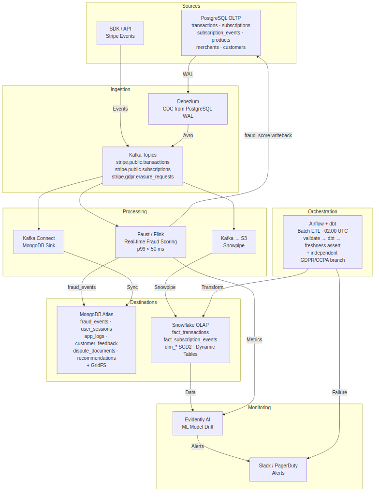
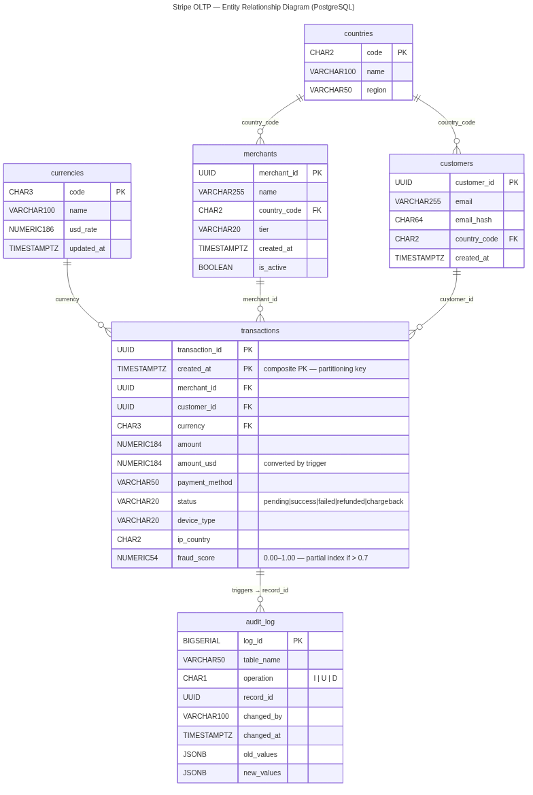

# Stripe Data Architecture — Architecture Overview

> Audience: architects, technical leads, and data engineers.
> Reading time: 30 minutes.
> Prerequisites: basic knowledge of relational and distributed databases.

---

## Overview

The architecture follows a **hybrid Lambda architecture paradigm**: a fast layer (real-time streaming) and a batch layer (next-day reprocessing) coexist and feed three complementary storage systems.


### End-to-End Data Flow

```text
PostgreSQL (OLTP)
    │
    ├─ CDC (Debezium + WAL) ──► Kafka ──► Faust (fraud scoring, < 100 ms)
    │                               │         │
    │                               │         ├──► MongoDB (fraud_events, ML features)
    │                               │         └──► PostgreSQL (fraud_score update)
    │                               │
    │                               └──► Snowpipe ──► Snowflake (OLAP)
    │
    └─ Airflow + dbt (batch ETL, 02:00 UTC, H+1 SLA) ──► Snowflake
```



---

## Technology Choices and Rationale

### OLTP: PostgreSQL + Citus

| Criterion            | PostgreSQL + Citus            | Alternative Rejected: CockroachDB       |
| -------------------- | ----------------------------- | --------------------------------------- |
| Transaction Latency  | < 10 ms (p99)                 | 20–40 ms (inter-node network overhead)  |
| ACID Compliance      | Full, native SSI support      | Full                                    |
| Scalability          | Horizontal sharding via Citus | Native but more complex                 |
| Operational Maturity | 20+ years in production       | 8 years                                 |
| CDC Integration      | Native `pgoutput` (PG10+)     | Debezium-supported CDC, but less mature |

**Decision:** PostgreSQL guarantees ACID transactions with latency below 10 ms. Citus enables horizontal sharding by `merchant_id` without requiring changes to application code. Synchronous replication (1 primary + 2 replicas, quorum writes) ensures an RPO of 0.

### OLAP: Snowflake

| Criterion                  | Snowflake                                     | Alternative Rejected: Amazon Redshift |
| -------------------------- | --------------------------------------------- | ------------------------------------- |
| Compute/Storage Separation | Native                                        | Tightly coupled                       |
| Elastic Scaling            | Independent warehouses (scale in ~30 seconds) | Cluster resizing (minutes)            |
| Time Travel                | 90 days                                       | 1–7 days                              |
| dbt Integration            | Native (atomic MERGE operations)              | Supported but more limited            |
| Unpredictable Workloads    | Well suited (pay-per-query)                   | Costly idle compute                   |

**Decision:** The separation of compute and storage enables analytical warehouses to scale independently without disruption. The 90-day Time Travel capability supports PCI DSS audits and data reprocessing following pipeline failures.

### NoSQL: MongoDB Atlas

| Criterion            | MongoDB Atlas                          | Alternative Rejected: Apache Cassandra  |
| -------------------- | -------------------------------------- | --------------------------------------- |
| Aggregation Pipeline | Rich, single network round trip        | Limited (no native `$lookup`)           |
| Flexible Schema      | Native                                 | No (fixed schema model)                 |
| ML Integration       | Built-in Atlas Search (Lucene)         | Separate Elasticsearch cluster required |
| Change Streams       | Native (replaces Debezium for MongoDB) | Not available                           |
| Ad Hoc Queries       | Excellent                              | Limited (query-first design)            |

**Decision:** The aggregation pipeline enables machine learning feature transformations in a single network round trip. Atlas Search removes the need for a separate Elasticsearch cluster for full-text search across logs and events.

### Pipeline: Kafka + Debezium + Faust + Airflow + dbt

* **Kafka**: central event bus, supporting 1M+ messages per second, with 7-day retention.
* **Debezium**: CDC from the PostgreSQL WAL using `pgoutput` (native to PG10+, Citus-compatible). SMTs are used for GDPR-compliant data masking in transit.
* **Faust**: Python-based stream processing (alternative to Flink/Java), using 5-minute tumbling windows for velocity calculations, with latency below 100 ms.
* **Airflow**: batch orchestration through the `stripe_daily_etl` DAG, scheduled at 02:00 UTC, H+1 SLA, and exponential retries (5/15/45 minutes).
* **dbt**: version-controlled SQL transformations, integrated data testing, auto-generated documentation, and Type 2 SCD management through snapshots.

---

## Data Model

### OLTP ERD (PostgreSQL)



Core tables: `transactions`, `merchants`, `customers`, and `currencies`.

Monthly range partitioning on `created_at`. Citus sharding on `merchant_id`.

### OLAP Star Schema (Snowflake)

```text
dim_date ──┐
dim_customer ──┤
dim_merchant ──┼──► fact_transactions
dim_currency ──┤
dim_payment_method ──┘
```

Type 2 SCDs are implemented for `dim_customer` and `dim_merchant` using the columns `valid_from`, `valid_to`, and `is_current`.

Snowflake Dynamic Tables are used for hourly pre-aggregations (merchant revenue and fraud rates).

### MongoDB Collections

| Collection      | Purpose                                | Shard Key     |
| --------------- | -------------------------------------- | ------------- |
| `fraud_events`  | Fraud events and ML features           | `merchant_id` |
| `user_sessions` | Browser sessions for the feature store | `customer_id` |
| `app_logs`      | Structured application logs            | `service`     |

---

## SLAs and Performance Objectives

| Metric                    | Target      | Mechanism                                                   |
| ------------------------- | ----------- | ----------------------------------------------------------- |
| OLTP Availability         | 99.99%      | Synchronous replication + automatic failover < 30 s         |
| Transaction Latency (p99) | < 50 ms     | PgBouncer, partial indexes, partitioning                    |
| RPO                       | 0           | Synchronous replication (quorum writes)                     |
| RTO                       | < 30 s      | Automated Citus failover                                    |
| Fraud Detection           | < 100 ms    | Faust streaming, in-memory features                         |
| ML Inference              | < 50 ms p99 | FastAPI + in-memory XGBoost model                           |
| Batch ETL SLA             | H+1         | Airflow + dbt, previous-day data available before 06:00 UTC |
| OLAP Queries (p99)        | < 1 s       | Automatic Snowflake clustering on `date_sk` / `merchant_sk` |

---

## Security Overview

| Layer     | Control           | Implementation                                  |
| --------- | ----------------- | ----------------------------------------------- |
| Transport | Mandatory TLS 1.3 | Nginx, Kafka SSL, automatic certificate renewal |
| Storage   | AES-256 at rest   | AWS KMS, monthly key rotation                   |
| Access    | RBAC + MFA        | Okta SSO, principle of least privilege          |
| Audit     | Immutable logs    | PostgreSQL audit_log + AWS CloudTrail           |
| PCI DSS   | PAN tokenisation  | Stripe Vault — no plaintext PANs                |
| GDPR      | Automated erasure | `gdpr_erasure.sql` procedure                    |

---

## ML Integration

```text
MongoDB (fraud_events)
    │
    ▼
Feast Feature Store  ──►  MLflow Training  ──►  FastAPI Serving (< 50 ms p99)
                                                        │
                                                        ▼
                                              Evidently AI Monitoring
                                              (drift, performance, alerts)
```

Two models are currently deployed in production:

| Model            | Algorithm | AUC  | Business Impact            |
| ---------------- | --------- | ---- | -------------------------- |
| Fraud Detection  | XGBoost   | 0.93 | −40% fraud ($15M/year)     |
| Churn Prediction | LightGBM  | 0.87 | +12% retention ($25M/year) |

---

> For the complete implementation (code, queries, and operational runbooks), see the Detailed Documentation (`03_DETAILED_README.md`).
